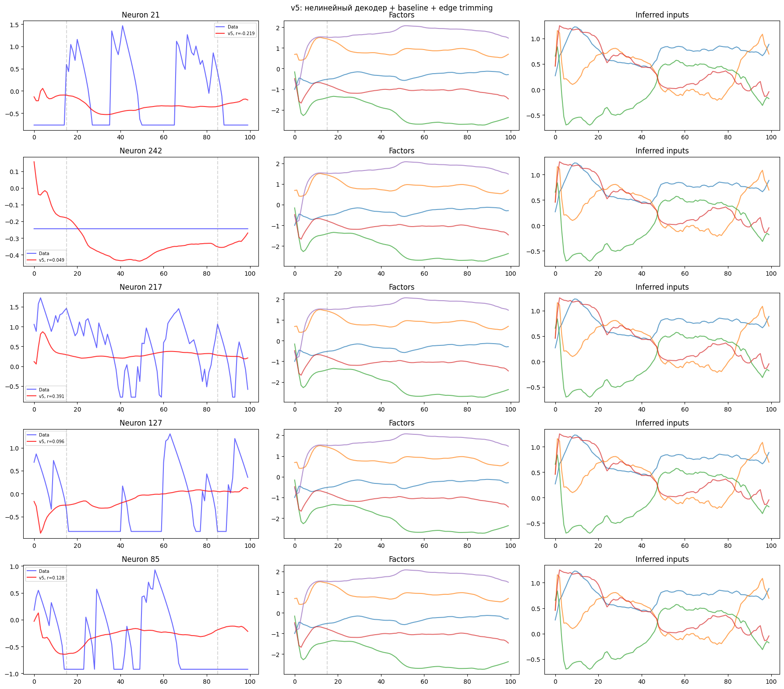
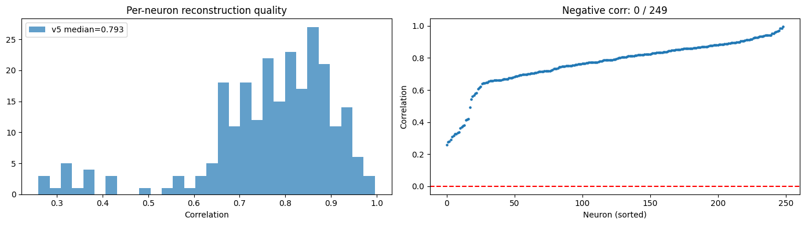
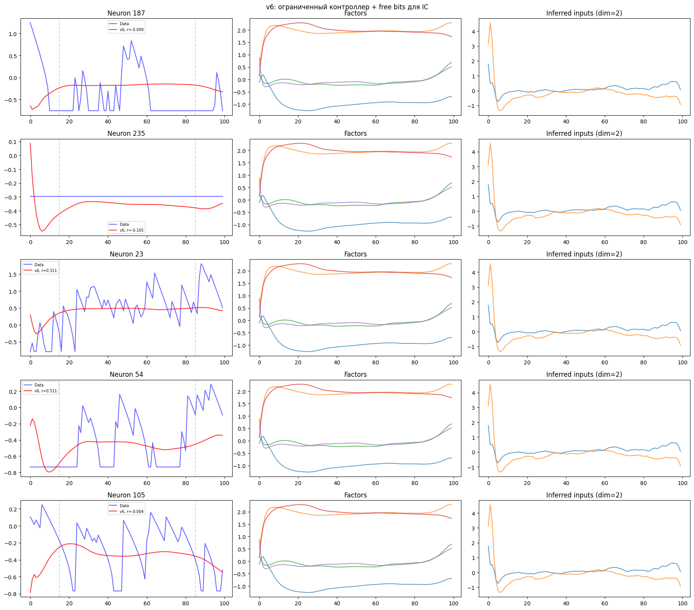
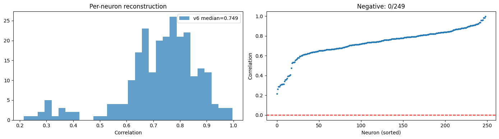
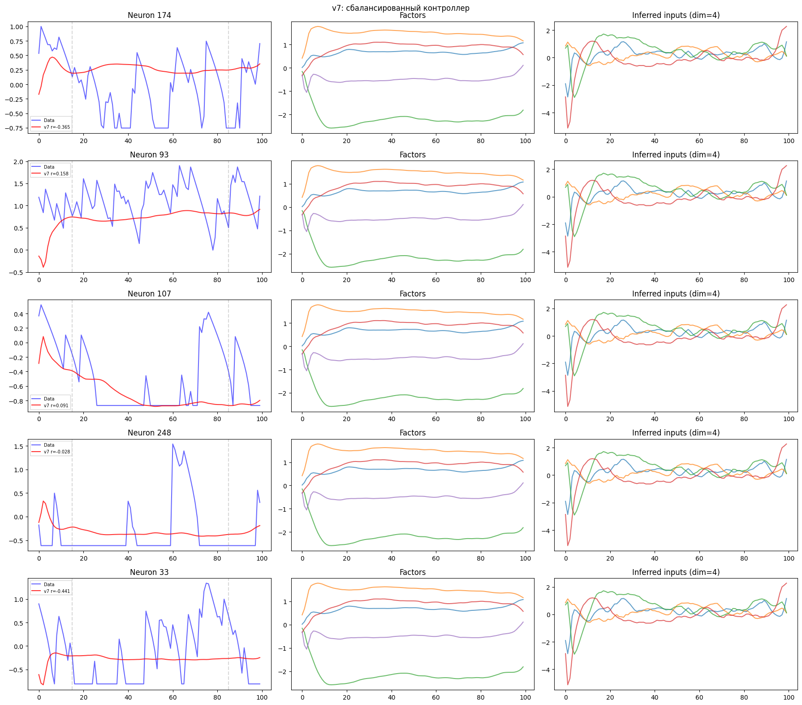
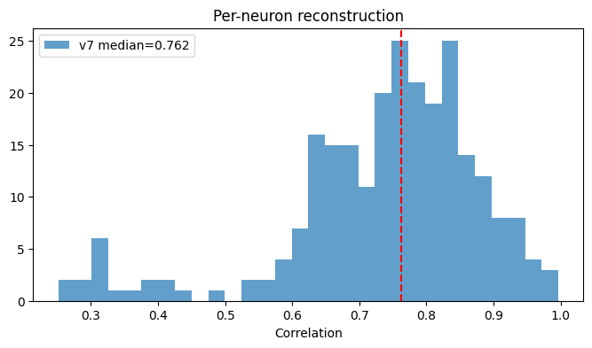

# CaLFADS для кальциевого имиджинга гиппокампа

Применение методов латентной динамики к данным минископной кальциевой визуализации нейронов CA1 гиппокампа мышей.

## О чём этот проект

Когда мы записываем активность сотен нейронов одновременно, мы получаем 249 временных рядов по одному на нейрон. Но нейроны не работают независимо: их активность определяется состоянием нейронной сети, которое можно описать гораздо меньшим числом переменных. LFADS это модель, которая находит эти скрытые переменные (латентные факторы) и восстанавливает чистый сигнал каждого нейрона, убирая шум. Но LFADS создан для спайковых данных (электрофизиология), а у нас кальциевый имиджинг другой тип сигнала с собственной динамикой. CaLFADS решает эту проблему, добавляя модель кальциевого спада.

## Данные

- **Эксперимент:** NOF_H06_1D
- **Животное:** мышь с минископом, запись из зоны CA1 гиппокампа
- **Нейроны:** 249 одновременно записанных клеток
- **Длительность:** 15 минут свободного исследования арены с объектами (17860 кадров при 20 fps)
- **Поведение:** координаты (x, y), скорость, направление головы, взаимодействие с объектами, замирание, локомоция и т д всего 18 переменных

Поскольку LFADS ожидает данные в виде коротких трайлов, а у нас одна непрерывная запись, мы нарезаем её на перекрывающиеся сегменты по 100 кадров (~5 секунд) с шагом 20 кадров (80% перекрытие). Получается 888 сегментов, из которых 710 идут на обучение и 178 на валидацию.


----
## Некоторые формулы которые могу понадобиться


### Общая функция потерь (ELBO)

Модель минимизирует:

$$
\mathcal{L} = \underbrace{\mathcal{L}_{\text{recon}}}_{\text{качество реконструкции}} + \underbrace{w_{\text{ic}} \cdot \mathrm{KL}_{\text{ic}}}_{\text{штраф за IC}} + \underbrace{w_{\text{co}} \cdot \mathrm{KL}_{\text{co}}}_{\text{штраф за контроллер}}
$$

Три слагаемых конкурируют: реконструкция хочет передать максимум информации через IC и контроллер, а KL-штрафы хотят ограничить эту передачу. Баланс определяется весами $w_{\text{ic}}$ и $w_{\text{co}}$.

##

**Reconstruction loss** отрицательный Gaussian log-likelihood:

$$
-\log p(x|r) = \frac{1}{2}\sum_{t,n}\left[\frac{(x_{t,n}-r_{t,n})^2}{\sigma_n^2} + 2\log\sigma_n\right]
$$

где $X_{t,n}$ наблюдение, $r_{t,n}$ предсказанный rate, $\sigma_n$ learned noise для нейрона n (обучаемый параметр log_noise для каждого нейрона)

Суммирование идёт по всем временным шагам (100 или 200) и нейронам (249).

*Gaussian вместо Poisson из оригинальной статьи, потому что кальциевый сигнал непрерывный. По сути это взвешенный MSE, где веса (log_noise) обучаются для каждого нейрона отдельно, отражая разный уровень шума в разных клетках.*


### Reconstruction loss (потери реконструкции)

$$
\mathcal{L}_{\text{recon}} = \frac{1}{N_{\text{el}}} \cdot \frac{1}{2}\sum_{t,n}\left[\frac{(x_{t,n}-r_{t,n})^2}{\sigma_n^2} + 2\log\sigma_n\right]
$$

- $x_{t,n}$ — наблюдение (кальциевый сигнал нейрона $n$ в момент $t$)
- $r_{t,n}$ — предсказание модели (rate) для того же нейрона и момента
- $\sigma_n$ — выученный уровень шума для нейрона $n$ (в коде: `exp(log_noise[n])`)
- $N_{\text{el}}$ — число элементов (batch × время × нейроны), для нормализации
- Суммирование по всем кадрам $t$ (70 после обрезки краёв) и нейронам $n$ (249)

Это отрицательный логарифм правдоподобия Гауссова распределения. По сути взвешенная среднеквадратичная ошибка, где вес каждого нейрона определяется его $\sigma_n$. Модель одновременно учится предсказывать сигнал $(r)$ и оценивать свою неуверенность $(\sigma)$.

Используем Gaussian вместо Poisson (как в оригинальной статье LFADS), потому что кальциевый сигнал непрерывный, а не дискретные счётчики спайков.

**Почему loss может быть отрицательным:** при $\sigma_n < 1$ слагаемое $2\log\sigma_n$ отрицательное. Если ошибка $(x-r)^2$ при этом мала, отрицательная часть доминирует. Отрицательный loss означает, что модель уверенно и точно предсказывает данные.


##

**KL divergence** формула для KL между $N(\mu, \sigma^2)$ и $N(0,1)$:

$$
\mathrm{KL} = -\frac{1}{2}\sum_i \left[1 + \log \sigma_i^2 - \mu_i^2 - \sigma_i^2\right]
$$

*KL-дивергенция — штраф, который не даёт энкодеру "запомнить" каждый сегмент отдельно. Она тянет выученное распределение q(g₀|x) к стандартному нормальному N(0,I), делая латентное пространство гладким. Без неё происходит переобучение, с ней слишком сильной posterior collapse (модель игнорирует IC).*


### KL-дивергенция для начальных условий (KL_ic)

$$
\mathrm{KL}_{\text{ic}} = -\frac{1}{2} \cdot \frac{1}{B}\sum_{b=1}^{B}\sum_{i=1}^{d_{\text{ic}}} \left[1 + \log \sigma_{b,i}^2 - \mu_{b,i}^2 - \sigma_{b,i}^2\right]
$$

- $\mu_{b,i}$, $\sigma_{b,i}$ — среднее и стд. отклонение выученного распределения начальных условий для сегмента $b$, размерность $i$
- $B$ — размер батча
- $d_{\text{ic}}$ — размерность начальных условий (ic_dim = 64)

Для каждого сегмента энкодер выдаёт не фиксированный вектор, а *распределение* $q(g_0|x) = \mathcal{N}(\mu, \sigma^2)$. KL измеряет, насколько это распределение отличается от стандартного нормального $\mathcal{N}(0, 1)$.

Если $\mu \approx 0$ и $\sigma \approx 1$ -> KL ≈ 0 -> IC не несёт информации (posterior collapse).
Если $\mu$ далеко от 0 или $\sigma$ мало -> KL большой -> IC кодирует много информации о сегменте.


### KL-дивергенция для контроллера (KL_co)

$$
\mathrm{KL}_{\text{co}} = -\frac{1}{2} \cdot \frac{1}{B \cdot T}\sum_{b,t,j} \left[1 + \log \sigma_{b,t,j}^2 - \mu_{b,t,j}^2 - \sigma_{b,t,j}^2\right]
$$

- $\mu_{b,t,j}$, $\sigma_{b,t,j}$ — параметры распределения выхода контроллера для сегмента $b$, кадра $t$, размерности $j$
- Суммирование по батчу, времени (после обрезки краёв) и размерностям выхода контроллера

Та же формула, но применяется на каждом кадре $t$ (не только один раз на сегмент, как IC). Штрафует контроллер за передачу информации в генератор.

##


### Coordinated Dropout

$$
\tilde{x}_{t,n} = \begin{cases} \frac{x_{t,n}}{1-p} & \text{если } m_n = 1 & \text{если } m_n = 0 \end{cases}
$$

- $m_n \sim \text{Bernoulli}(1-p)$ — маска для нейрона $n$ (одна и та же на всех кадрах $t$)
- $p = 0.3$ — вероятность маскировки (cd_rate)
- Деление на $(1-p)$ компенсирует уменьшение среднего (аналогично обычному dropout)

Ключевое отличие от обычного dropout: маска *одинаковая* по всем кадрам одного сегмента. Если нейрон 50 замаскирован — он замаскирован на всех 100 кадрах. Модель видит ~175 нейронов, но должна восстановить все 249 (включая замаскированные). Это заставляет модель учить корреляции между нейронами, а не копировать вход.

---


## Словарь гиперпараметров

### Размерности модели

| Параметр | Значение | Что означает |
|---|---|---|
| `n_neurons` | 249 | Число одновременно записанных нейронов |
| `ic_enc_dim` | 128 | Размер скрытого состояния IC-энкодера (двунаправленный GRU). Определяет, сколько информации энкодер может извлечь из сегмента. На выходе: 128×2 = 256 |
| `ci_enc_dim` | 64 | Размер скрытого состояния CI-энкодера (вход контроллера). Меньше IC-энкодера, чтобы ограничить пропускную способность контроллера |
| `ic_dim` | 64 | Размерность начальных условий $g_0$. Из этого вектора генератор стартует. Вся информация о «типе» сегмента должна поместиться в 64 числа |
| `co_dim` | 4 | Размерность выхода контроллера $u_t$. Сколько чисел контроллер может передать генератору на каждом кадре. 2 - мало (v6, контроллер молчит), 8 - много (v5, контроллер делает всё), 4 - компромисс (v7) |
| `gen_dim` | 200 | Размер скрытого состояния генератора (GRU). Самый большой компонент здесь живёт динамическая система |
| `con_dim` | 64 | Размер скрытого состояния контроллера (GRU). Определяет «вычислительную мощность» контроллера |
| `fac_dim` | 30–50 | Число латентных факторов. Главный выход модели — низкоразмерное описание состояния популяции на каждом кадре |

### Веса функции потерь

| Параметр | Значение | Что означает |
|---|---|---|
| `kl_ic_max` | 0.05–0.1 | Максимальный вес KL-штрафа на начальные условия. Определяет, насколько сильно модель наказывается за использование IC. Высокий -> IC коллапсирует, низкий -> IC переобучается |
| `kl_co_max` | 0.001–0.1 | Максимальный вес KL-штрафа на контроллер. Ключевой гиперпараметр, определяющий баланс IC/контроллер. 0.001 -> контроллер свободен (v5), 0.1 -> контроллер молчит (v6), 0.01 -> баланс (v7) |
| `ic_min_kl` | 0.1 | Порог free bits для IC. KL каждой размерности IC не может быть ниже этого значения в функции потерь |

### Разогрев (warm-up)

| Параметр | Значение | Что означает |
|---|---|---|
| `ic_warmup_start` | 100 | Эпоха, с которой начинает расти вес KL на IC |
| `ic_warmup_end` | 400 | Эпоха, к которой вес KL на IC достигает максимума |
| `co_warmup_start` | 200 | Начало разогрева KL на контроллер (позже, чем IC) |
| `co_warmup_end` | 600 | Конец разогрева KL на контроллер |

Разогрев нужен, чтобы модель сначала научилась реконструировать данные (без KL-штрафа), и только потом постепенно включалось давление на структуру латентного пространства.

### Регуляризация

| Параметр | Значение | Что означает |
|---|---|---|
| `cd_rate` | 0.3 | Coordinated Dropout: доля замаскированных нейронов на входе. 0 -> нет маскировки (модель находит тривиальное решение), 0.3 -> маскируется ~75 нейронов из 249 |
| `edge_trim` | 15 | Число кадров, обрезаемых с каждой стороны сегмента (переходный процесс генератора). Из 100 кадров в loss попадают кадры 15–85 |
| `dropout` | 0.05 | Обычный dropout в декодере |


---

## Версия 1: базовый LFADS

### Что сделано

Написан LFADS с нуля на PyTorch. Архитектура по статье:
- Двунаправленный GRU-энкодер читает весь сегмент и сжимает его в 64-мерный вектор -- начальное условие g₀
- GRU-генератор из g₀ разворачивает латентную динамику: на каждом кадре выдаёт 20-мерный вектор факторов
- Линейный декодер переводит 20 факторов обратно в 249 нейронов -- предсказывает чистый сигнал

Два отличия от оригинальной статьи: Gaussian модель наблюдений вместо Poisson (кальциевый сигнал непрерывный, не дискретный) и без контроллера (для простоты).

Данные нормализованы min-max на [0,1]. Нарезаны на 177 сегментов по 200 кадров (10 секунд) с перекрытием 50%. Обучение 1000 эпох.

<details> <summary>Показать код</summary>

```py
import torch
import torch.nn as nn
import torch.nn.functional as F
from torch.utils.data import DataLoader, TensorDataset


class SimpleLFADS(nn.Module): #Упрощённая реализация LFADS для кальциевых данных. Без контроллера, с Gaussian моделью наблюдений
    def __init__(self, n_neurons, ic_enc_dim=128, ic_dim=64, gen_dim=128, fac_dim=20, dropout=0.05):
        super().__init__()
        
        self.n_neurons = n_neurons
        self.ic_dim = ic_dim
        self.gen_dim = gen_dim
        self.fac_dim = fac_dim
        
        #ЭНКОДЕР
        # Bi-directional GRU читает весь трайл и выдаёт начальное условие
        self.encoder = nn.GRU(input_size=n_neurons, hidden_size=ic_enc_dim, bidirectional=True, batch_first=True)
        
        # Из выхода энкодера -> параметры нормального распределения для g0
        self.ic_mean = nn.Linear(ic_enc_dim * 2, ic_dim)
        self.ic_logvar = nn.Linear(ic_enc_dim * 2, ic_dim)
        
        #ГЕНЕРАТОР
        # Маппинг из IC в начальное состояние генератора
        self.ic_to_gen = nn.Linear(ic_dim, gen_dim)
        
        # Генератор GRU, который разворачивает динамику
        self.generator = nn.GRUCell(
            input_size=fac_dim,  # без контроллера вход = предыдущие факторы
            hidden_size=gen_dim)
        
        # Из состояния генератора в факторы (низкоразмерное представление)
        self.gen_to_fac = nn.Linear(gen_dim, fac_dim)
        
        #ДЕКОДЕР
        # Из факторов в параметры распределения для каждого нейрона
        self.fac_to_rate = nn.Linear(fac_dim, n_neurons)  # mean
        self.log_noise = nn.Parameter(torch.zeros(n_neurons))  # log(std)
        
        self.dropout = nn.Dropout(dropout)
    
    def encode(self, x):
        """x: [batch, time, neurons] -> g0_mean, g0_logvar: [batch, ic_dim]"""
        _, h = self.encoder(x)  # h: [2, batch, ic_enc_dim]
        h = torch.cat([h[0], h[1]], dim=-1)  # [batch, ic_enc_dim*2]
        return self.ic_mean(h), self.ic_logvar(h)
    
    def reparameterize(self, mean, logvar):
        std = torch.exp(0.5 * logvar)
        eps = torch.randn_like(std)
        return mean + eps * std
    
    def decode(self, g0, seq_len):
        """
        g0: [batch, ic_dim] в factors: [batch, time, fac_dim], 
                                rates: [batch, time, neurons]
        """
        batch_size = g0.shape[0]
        
        # Начальное состояние генератора
        gen_state = torch.tanh(self.ic_to_gen(g0))  # [batch, gen_dim]
        
        factors_list = []
        rates_list = []
        
        # Начальный вход генератора нули
        fac = torch.zeros(batch_size, self.fac_dim, device=g0.device)
        
        for t in range(seq_len):
            gen_state = self.generator(fac, gen_state)
            fac = self.dropout(self.gen_to_fac(gen_state))
            rate = self.fac_to_rate(fac)
            
            factors_list.append(fac)
            rates_list.append(rate)
        
        factors = torch.stack(factors_list, dim=1)  # [batch, time, fac_dim]
        rates = torch.stack(rates_list, dim=1) # [batch, time, neurons]
        
        return factors, rates
    
    def forward(self, x):
        """
        x: [batch, time, neurons]
        Returns: rates, factors, ic_mean, ic_logvar
        """
        seq_len = x.shape[1]
        
        # Encode
        ic_mean, ic_logvar = self.encode(x)
        
        # Reparameterize
        g0 = self.reparameterize(ic_mean, ic_logvar)
        
        # Decode
        factors, rates = self.decode(g0, seq_len)
        
        return rates, factors, ic_mean, ic_logvar
    
    def loss(self, x, kl_weight=1.0):
        """Вычисление ELBO loss"""
        rates, factors, ic_mean, ic_logvar = self.forward(x)
        
        # Reconstruction loss (Gaussian)
        noise_std = torch.exp(self.log_noise)
        recon_loss = 0.5 * torch.sum(((x - rates) / noise_std) ** 2 + 2 * self.log_noise) / x.shape[0]
        
        # KL divergence
        kl_loss = -0.5 * torch.sum(1 + ic_logvar - ic_mean.pow(2) - ic_logvar.exp()) / x.shape[0]
        
        total_loss = recon_loss + kl_weight * kl_loss
        
        return total_loss, recon_loss, kl_loss, factors
```
</details>

### Результаты

**Кривые обучения.** Loss ушёл в -100000 (отрицательный, это нормально для Gaussian log-likelihood). Но train loss продолжал падать, а valid остановился на -91000. Разрыв ~10%, получилось переобучение. Причина: 141 тренировочный сегмент слишком мало для модели с ~250K параметров.

**Латентные факторы горизонтальные линии.** На графике временной эволюции факторов все 5 кривых практически прямые горизонтальные линии. Генератор нашёл фиксированную точку и выдаёт одну и ту же константу на каждом из 200 кадров. Динамики нет.

**PCA факторов два кластера.** Вместо непрерывного облака, отражающего плавные переходы между состояниями поведения, видны два изолированных кластера. Модель выучила бимодальное представление (вероятно, "движение" и "покой"), но без плавных переходов.

?????????Это признак *posterior collapse* или слишком сильного влияния IC на генератор.???????????????

????????**Isomap распался на 23 компоненты.** Факторы между сегментами не связаны. Нужен overlap-aware метод реконструкции.


**Декодирование СКОРОСТИ.** $R^2$ предсказания скорости из факторов = 0.28. Из сырых данных = 0.44. Факторы хуже сырых данных.

Из LFADS факторов: $R^2$ train=0.318, valid=0.284

Из сырых данных: $R^2$ train=0.518, valid=0.437

```
def decode_behavior(factors_np, behavior_data, train_idx, valid_idx): #Линейное декодирование поведения из латентных факторов
    # [n_trials, time, dim] -> [n_trials * time, dim]
    n_time = factors_np.shape[1]
    
    X_train = factors_np[train_idx].reshape(-1, factors_np.shape[2])
    X_valid = factors_np[valid_idx].reshape(-1, factors_np.shape[2])
    
    y_train = behavior_data[train_idx].reshape(-1)
    y_valid = behavior_data[valid_idx].reshape(-1)
    
    # Ridge regression
    reg = Ridge(alpha=1.0)
    reg.fit(X_train, y_train)
    
    y_pred_train = reg.predict(X_train)
    y_pred_valid = reg.predict(X_valid)
    
    r2_train = r2_score(y_train, y_pred_train)
    r2_valid = r2_score(y_valid, y_pred_valid)
    
    return r2_train, r2_valid, y_pred_valid, y_valid
```


По сути получился нелинейный PCA, а не динамическая система. В PCA латентного пространства два изолированных кластера вместо непрерывной траектории


---


## Версия 2: исправление нормализации и регуляризации

### Что изменилось

1. **Нормализация:** sqrt-zscore вместо min-max. Sqrt стабилизирует дисперсию кальциевого сигнала (много нулей, редкие большие пики), zscore уравнивает масштабы между нейронами (нейрон 30 срабатывает до 150, нейрон 40 до 6).

2. **Coordinated dropout (CD=0.3):** главный регуляризатор LFADS. На входе энкодера случайно маскируются 30% нейронов (одни и те же на всех кадрах), но на выходе модель должна восстановить ВСЕ 249 нейронов, включая замаскированные. Это заставляет модель учить корреляции между нейронами — популяционную динамику, а не копировать вход на выход.

3. **Больше данных:** сегменты по 100 кадров с перекрытием 80%, получилось 888 сегментов вместо 177. Нормализация loss по всем элементам (не только по batch size).

*не важные изменения*

4. **Усиление KL:** в 1 версии KL-дивергенция составляла 0.075% от total loss, это значит, что оптимизатор её не видел. Нормализация loss по всем элементам (деление на n_time × n_neurons, а не только на batch_size) уравняла масштабы: recon ~0.25, KL ~0.3. Теперь KL реально влияет на структуру латентного пространства.

5. **Правильная сборка непрерывных факторов:** вместо склейки независимых сегментов (что давало 23 disconnected components в Isomap), усреднение факторов в зонах перекрытия. Каждый кадр покрывается ~5 сегментами, их факторы усредняются и получается гладкий непрерывный ряд.

6. **Per-neuron noise model:** для каждого нейрона модель учит свой уровень шума $\sigma_n$. Нейроны с высоким SNR получают маленький $\sigma$ (модель уверена), шумные нейроны большой $\sigma$ (модель "говорит", что не знает какой сигнал -- получается шумный нейрон). Это позволяет модели фокусироваться на информативных нейронах, не тратя ёмкость на шумные.

### Что исправляем (кратко)
1. Z-score нормализация вместо min-max
2. Coordinated dropout (главный регуляризатор в LFADS)
3. Больше сегментов (меньше длина, больше перекрытие)
4. Усиление KL, чтобы факторы были информативными
5. Правильная сборка непрерывных факторов
6. Per-neuron noise model

<details> <summary>Показать код</summary>

```py
class CoordinatedDropout(nn.Module):
    """
    Coordinated Dropout регуляризатор LFADS
    
    Обнуляет одни и те же нейроны на ВХОДЕ энкодера, но оставляет их на ВЫХОДЕ (в reconstruction target). Это заставляет модель реконструировать активность нейронов, которых она не видела т.е. выучивать популяционную динамику, а не identity mapping.
    """
    def __init__(self, rate=0.3):
        super().__init__()
        self.rate = rate
    
    def forward(self, x):
        """x: [batch, time, neurons]. Returns: masked_x, mask"""
        if not self.training or self.rate == 0:
            return x, torch.ones_like(x)
        
        # Маска одинакова для всех timesteps (координированный dropout)
        batch, time, neurons = x.shape
        mask = (torch.rand(batch, 1, neurons, device=x.device) > self.rate).float()
        mask = mask.expand_as(x)
        
        # Масштабирование для сохранения ожидаемого значения
        masked_x = x * mask / (1 - self.rate)
        return masked_x, mask


class LFADS(nn.Module):
    def __init__(self, n_neurons, ic_enc_dim=128, ic_dim=64,
                 gen_dim=200, fac_dim=30, cd_rate=0.3, dropout=0.1):
        super().__init__()
        
        self.n_neurons = n_neurons
        self.ic_dim = ic_dim
        self.gen_dim = gen_dim
        self.fac_dim = fac_dim
        
        # Coordinated dropout
        self.cd = CoordinatedDropout(rate=cd_rate)
        
        #ЭНКОДЕР
        self.encoder = nn.GRU(
            input_size=n_neurons,
            hidden_size=ic_enc_dim,
            bidirectional=True,
            batch_first=True,
            num_layers=1
        )
        self.enc_ln = nn.LayerNorm(ic_enc_dim * 2)
        self.ic_mean = nn.Linear(ic_enc_dim * 2, ic_dim)
        self.ic_logvar = nn.Linear(ic_enc_dim * 2, ic_dim)
        
        # Инициализация logvar чтобы начинать с маленькой дисперсии
        nn.init.constant_(self.ic_logvar.bias, -3.0)
        nn.init.zeros_(self.ic_logvar.weight)
        
        #ГЕНЕРАТОР
        self.ic_to_gen = nn.Linear(ic_dim, gen_dim)
        self.generator = nn.GRUCell(input_size=1, hidden_size=gen_dim)  # минимальный вход
        self.gen_to_fac = nn.Sequential(
            nn.Linear(gen_dim, fac_dim),
            nn.Tanh()  # ограничиваем диапазон факторов
        )
        
        #ДЕКОДЕР
        self.fac_to_rate = nn.Linear(fac_dim, n_neurons)
        # Per-neuron noise (learned)
        self.log_noise = nn.Parameter(torch.zeros(n_neurons))
        
        self.dropout = nn.Dropout(dropout)
    
    def encode(self, x):
        output, h = self.encoder(x)
        h = torch.cat([h[0], h[1]], dim=-1)
        h = self.enc_ln(h)
        return self.ic_mean(h), self.ic_logvar(h)
    
    def reparameterize(self, mean, logvar):
        if self.training:
            std = torch.exp(0.5 * logvar)
            return mean + std * torch.randn_like(std)
        return mean  # при eval не добавляем шум
    
    def decode(self, g0, seq_len):
        batch_size = g0.shape[0]
        gen_state = torch.tanh(self.ic_to_gen(g0))
        
        dummy_input = torch.zeros(batch_size, 1, device=g0.device)
        
        factors_list = []
        rates_list = []
        
        for t in range(seq_len):
            gen_state = self.generator(dummy_input, gen_state)
            fac = self.gen_to_fac(gen_state)
            rate = self.fac_to_rate(self.dropout(fac))
            
            factors_list.append(fac)
            rates_list.append(rate)
        
        factors = torch.stack(factors_list, dim=1)
        rates = torch.stack(rates_list, dim=1)
        return factors, rates
    
    def forward(self, x):
        seq_len = x.shape[1]
        
        # Coordinated dropout на входе энкодера
        x_masked, cd_mask = self.cd(x)
        
        ic_mean, ic_logvar = self.encode(x_masked)
        g0 = self.reparameterize(ic_mean, ic_logvar)
        factors, rates = self.decode(g0, seq_len)
        
        return rates, factors, ic_mean, ic_logvar, cd_mask
    
    def loss(self, x, kl_weight=1.0):
        rates, factors, ic_mean, ic_logvar, cd_mask = self.forward(x)
        
        noise_std = torch.exp(self.log_noise).clamp(min=0.01, max=10.0)
        
        # Reconstruction: Gaussian NLL, нормализованный по размерности
        n_elements = x.shape[0] * x.shape[1] * x.shape[2]
        recon_loss = 0.5 * torch.sum(
            ((x - rates) / noise_std) ** 2 + 2 * torch.log(noise_std)
        ) / n_elements
        
        # KL, нормализованный по batch
        kl_loss = -0.5 * torch.mean(
            1 + ic_logvar - ic_mean.pow(2) - ic_logvar.exp()
        )
        
        total = recon_loss + kl_weight * kl_loss
        return total, recon_loss, kl_loss, factors
    
    @torch.no_grad()
    def extract_factors(self, x): #Извлечение факторов в eval-режиме (без dropout и шума)
        self.eval()
        rates, factors, ic_mean, ic_logvar, _ = self.forward(x)
        return factors.cpu().numpy(), rates.cpu().numpy(), ic_mean.cpu().numpy()
```

</details>

### Результаты

**Переобучение устранено.** Train loss (~0.28) стал *выше* valid (~0.26). То есть получился результат обратный к версии 1 (это хорошо): coordinated dropout делает задачу при обучении сложнее (часть нейронов замаскирована), а при валидации маскировки нет, значит loss ниже.


**Латентное пространство стало непрерывным.** Вместо двух кластеров, получилось плавное облако с градиентами (позиция X, Y). Модель выучила пространственную информацию.


**Декодирование резко улучшилось.** R² скорости: 0.28 в 0.84. R² позиции X: 0.86, Y: 0.88. Факторы теперь несут осмысленную информацию о поведении.

**НО реконструкция по-прежнему горизонтальная.** Красная линия (предсказание LFADS) плоская. Модель предсказывает одну и ту же константу все 100 кадров. Высокий $R^2$ при этом объясняется тем, что декодирование использует средние факторы по сегменту, разные сегменты получают разные константы, и они коррелируют с поведением. Но вся временная информация внутри 5-секундного окна потеряна.


**Корреляция факторов с поведением** показывает осмысленную структуру: разные факторы кодируют разные переменные (Factor 7 -> позиция X, Factor 21 -> локомоция, Factor 28 -> позиция Y).


### Вывод

Нормализация и CD решили проблему переобучения и структуры латентного пространства. Но генератор всё ещё выдаёт константу нужен контроллер.


---

## Версия 3: контроллер

### Что изменили

Добавили контроллер вторую RNN, которая на каждом кадре t:
1. Получает информацию от CI-энкодера (bidirectional GRU, который видит весь сегмент)
2. Выдаёт 4-мерный вектор inferred inputs $u_t$
3. Подаёт его в генератор

Без контроллера генератор получает одинаковый вход (нули) на каждом кадре -> не имеет причин менять состояние -> фиксированная точка. С контроллером вход меняется -> состояние меняется -> факторы меняются.

Inferred inputs это вариационные: контроллер выдаёт mean и logvar, из которых сэмплируется $u_t$. KL штрафует отклонение от N(0,1), заставляя контроллер передавать только необходимую информацию.


<details> <summary>Показать код</summary>

```py
class CoordinatedDropout(nn.Module):
    def __init__(self, rate=0.3):
        super().__init__()
        self.rate = rate
    
    def forward(self, x):
        if not self.training or self.rate == 0:
            return x, torch.ones_like(x)
        batch, time, neurons = x.shape
        mask = (torch.rand(batch, 1, neurons, device=x.device) > self.rate).float()
        mask = mask.expand_as(x)
        return x * mask / (1 - self.rate), mask


class LFADS(nn.Module):
    """
    Полная архитектура LFADS с контроллером.
    
    Соответствие статье (Pandarinath et al. 2018, Fig. 1):
    - IC encoder (bi-GRU) -> начальное условие g₀
    - CI encoder (bi-GRU) -> временные входы для контроллера  
    - Controller (forward GRU) -> inferred inputs uₜ
    - Generator (forward GRU) -> скрытая динамика -> факторы fₜ
    - Readout (linear) -> rates для каждого нейрона
    """
    def __init__(self, n_neurons, 
                 ic_enc_dim=128, ci_enc_dim=128,
                 ic_dim=64, co_dim=4,
                 gen_dim=200, con_dim=128, fac_dim=30,
                 cd_rate=0.3, dropout=0.1):
        super().__init__()
        
        self.n_neurons = n_neurons
        self.ic_dim = ic_dim
        self.co_dim = co_dim
        self.gen_dim = gen_dim
        self.con_dim = con_dim
        self.fac_dim = fac_dim
        
        self.cd = CoordinatedDropout(rate=cd_rate)
        
        #IC ЭНКОДЕР: весь трайл -> начальное условие
        self.ic_encoder = nn.GRU(
            input_size=n_neurons, hidden_size=ic_enc_dim,
            bidirectional=True, batch_first=True
        )
        self.ic_mean = nn.Linear(ic_enc_dim * 2, ic_dim)
        self.ic_logvar = nn.Linear(ic_enc_dim * 2, ic_dim)
        nn.init.constant_(self.ic_logvar.bias, -3.0)
        nn.init.zeros_(self.ic_logvar.weight)
        
        #CI ЭНКОДЕР: весь трайл -> входы контроллера на каждом шаге
        self.ci_encoder = nn.GRU(
            input_size=n_neurons, hidden_size=ci_enc_dim,
            bidirectional=True, batch_first=True
        )
        # CI энкодер выдаёт вектор на каждом шаге t (не только финальный h)
        
        #КОНТРОЛЛЕР: ci_output + факторы -> inferred input u_t
        self.controller = nn.GRUCell(
            input_size=ci_enc_dim * 2 + fac_dim,  # CI output + предыдущие факторы
            hidden_size=con_dim
        )
        # Контроллер тоже вариационный: выдаёт mean и logvar для u_t
        self.co_mean = nn.Linear(con_dim, co_dim)
        self.co_logvar = nn.Linear(con_dim, co_dim)
        nn.init.constant_(self.co_logvar.bias, -3.0)
        nn.init.zeros_(self.co_logvar.weight)
        
        #ГЕНЕРАТОР: g₀ + u_t -> динамика -> факторы
        self.ic_to_gen = nn.Linear(ic_dim, gen_dim)
        self.generator = nn.GRUCell(
            input_size=co_dim,  # вход = inferred inputs от контроллера
            hidden_size=gen_dim
        )
        self.gen_to_fac = nn.Linear(gen_dim, fac_dim)
        
        #ДЕКОДЕР
        self.fac_to_rate = nn.Linear(fac_dim, n_neurons)
        self.log_noise = nn.Parameter(torch.zeros(n_neurons))
        
        self.dropout = nn.Dropout(dropout)
    
    def encode(self, x_masked):
        # IC encoder -> финальные hidden states -> g₀
        _, h_ic = self.ic_encoder(x_masked)
        h_ic = torch.cat([h_ic[0], h_ic[1]], dim=-1)
        ic_mean = self.ic_mean(h_ic)
        ic_logvar = self.ic_logvar(h_ic)
        
        # CI encoder -> output на каждом шаге -> входы контроллера
        ci_output, _ = self.ci_encoder(x_masked)  # [batch, time, ci_enc_dim*2]
        
        return ic_mean, ic_logvar, ci_output
    
    def reparameterize(self, mean, logvar):
        if self.training:
            std = torch.exp(0.5 * logvar)
            return mean + std * torch.randn_like(std)
        return mean
    
    def forward(self, x):
        batch, seq_len, n = x.shape
        
        # Coordinated dropout
        x_masked, cd_mask = self.cd(x)
        
        # Encode
        ic_mean, ic_logvar, ci_output = self.encode(x_masked)
        g0 = self.reparameterize(ic_mean, ic_logvar)
        
        # Инициализация
        gen_state = torch.tanh(self.ic_to_gen(g0))  # [batch, gen_dim]
        con_state = torch.zeros(batch, self.con_dim, device=x.device)
        fac = torch.zeros(batch, self.fac_dim, device=x.device)
        
        factors_list = []
        rates_list = []
        co_means = []
        co_logvars = []
        
        for t in range(seq_len):
            # 1. Контроллер: получает CI output + предыдущие факторы
            con_input = torch.cat([ci_output[:, t, :], fac], dim=-1)
            con_state = self.controller(con_input, con_state)
            
            # 2. Inferred input (вариационный)
            u_mean = self.co_mean(con_state)
            u_logvar = self.co_logvar(con_state)
            u = self.reparameterize(u_mean, u_logvar)
            
            co_means.append(u_mean)
            co_logvars.append(u_logvar)
            
            # 3. Генератор: получает inferred input
            gen_state = self.generator(u, gen_state)
            
            # 4. Факторы и rates
            fac = self.gen_to_fac(gen_state)
            rate = self.fac_to_rate(self.dropout(fac))
            
            factors_list.append(fac)
            rates_list.append(rate)
        
        factors = torch.stack(factors_list, dim=1)    # [batch, time, fac_dim]
        rates = torch.stack(rates_list, dim=1)        # [batch, time, neurons]
        co_means = torch.stack(co_means, dim=1)       # [batch, time, co_dim]
        co_logvars = torch.stack(co_logvars, dim=1)   # [batch, time, co_dim]
        
        return rates, factors, ic_mean, ic_logvar, co_means, co_logvars
    
    def loss(self, x, kl_ic_weight=1.0, kl_co_weight=1.0):
        rates, factors, ic_mean, ic_logvar, co_means, co_logvars = self.forward(x)
        
        noise_std = torch.exp(self.log_noise).clamp(min=0.01, max=10.0)
        n_elements = x.shape[0] * x.shape[1] * x.shape[2]
        
        # Reconstruction
        recon_loss = 0.5 * torch.sum(
            ((x - rates) / noise_std) ** 2 + 2 * torch.log(noise_std)
        ) / n_elements
        
        # KL для начальных условий (IC)
        kl_ic = -0.5 * torch.mean(1 + ic_logvar - ic_mean.pow(2) - ic_logvar.exp())
        
        # KL для inferred inputs (CO) суммируется по времени
        kl_co = -0.5 * torch.mean(1 + co_logvars - co_means.pow(2) - co_logvars.exp())
        
        total = recon_loss + kl_ic_weight * kl_ic + kl_co_weight * kl_co
        
        return total, recon_loss, kl_ic, kl_co, factors
    
    @torch.no_grad()
    def extract_factors(self, x):
        self.eval()
        rates, factors, _, _, co_means, _ = self.forward(x)
        return (
            factors.cpu().numpy(), 
            rates.cpu().numpy(),
            co_means.cpu().numpy()  # inferred inputs тоже интересны
        )
```

</details>

### Результаты


**Факторы стали динамическими.** На графике видно, как 5 факторов поднимаются, опускаются, пересекаются внутри 100-кадрового сегмента. Получилась динамическая система.

**Реконструкция следит за сигналом.** Красная линия теперь повторяет медленную огибающую синих данных. Не идеально (не ловит быстрые пики), но медленные тренды — да.


**Per-neuron качество реконструкции.** Медиана корреляции данные-LFADS = 0.63 по всем 249 нейронам. 210 нейронов выше 0.5, ни один ниже 0.1.
```
Нейроны с r > 0.5: 210 / 249
Нейроны с r > 0.7: 78 / 249
Нейроны с r < 0.1: 0 / 249
```


**LFADS > PCA при одинаковой размерности.** Per-timepoint декодирование позиции X: LFADS (30 факторов) = 0.75, PCA (30 компонент) = 0.70. Нелинейная динамическая модель извлекает больше информации, чем линейное снижение размерности.

```
Target                          PCA (30)       LFADS factors (30)        LFADS rates (249)        Raw calcium (249)
-------------------------------------------------------------------------------------------------------------------
speed                             0.335                    0.340                    0.340                    0.473*
x                                 0.704                    0.750                    0.750                    0.850*
y                                 0.690                    0.699                    0.699                    0.858*
locomotion                        0.236                    0.239                    0.239                    0.385*
freezing                          0.369                    0.379                    0.379                    0.465*
```

**Isomap на факторах лучше восстанавливает пространственную структуру арены**, чем Isomap на PCA. Цветовые градиенты (позиция X, Y) более упорядочены.


**Непрерывные факторы (после сборки из перекрывающихся сегментов) следят за позицией мыши** на протяжении всех 15 минут записи. PC0 факторов отслеживает Position X.


**Inferred inputs бесполезны**. Корреляции с поведением ~0.02-0.08 практически ноль. Контроллер не научился кодировать поведенчески значимые события. Причина: kl_co_max=0.01 слишком сильно давит inferred inputs к нулю. Нужно ослабить.

```
Корреляция inferred inputs с поведением (per-timepoint):
            speed       accel           x           y
u  0       0.029      -0.015      -0.038       0.022
u  1       0.057      -0.012       0.056      -0.080
u  2       0.022      -0.025      -0.026      -0.005
u  3      -0.066       0.007       0.047      -0.035
```

### Вывод

Контроллер нужен. Без него нет динамической системы и LFADS превращается в PCA

Нужно работать над inferred inputs (параметры `kl_co_max` и `co_dim`)


---

## Версия 4: подбор силы контроллера

### Проблема

После v3 стало понятно, что контроллер работает (факторы стали динамическими). Но непонятно, *сколько* информации контроллер должен передавать. Параметр `kl_co_max` определяет "стоимость" одного бита информации через контроллер. Если стоимость **низкая** — контроллер передаёт всё подряд, генератор ленится. Если стоимость **высокая** — контроллер молчит, генератор работает один.

Вопрос: есть ли оптимальное значение?

### Что изменили

1. Увеличили число факторов `fac_dim` с 30 до 50 (чтобы лучше покрыть 249 нейронов)
2. Увеличили размерность выхода контроллера `co_dim` с 4 до 8
3. Обучили 5 моделей с разными значениями `kl_co_max`: `0.0001`, `0.001`, `0.005`, `0.01`, `0.05`

Для каждой модели измерили:
- Качество реконструкции (valid loss: чем ниже, тем точнее модель восстанавливает сигнал)
- Качество декодирования позиции и скорости из факторов ($R^2$: доля объяснённой дисперсии, от 0 до 1)

### Результаты

Декодирование **практически не зависит от kl_co_max**:

| kl_co_max | Valid loss | $R^2$ скорости | $R^2$ позиции X | $R^2$ позиции Y |
|-----------|-----------|-------------|-------------|-------------|
| 0.0001 | 0.079 | 0.362 | 0.821 | 0.777 |
| 0.001 | 0.082 | 0.362 | 0.816 | 0.773 |
| 0.005 | 0.088 | 0.357 | 0.816 | 0.783 |
| 0.01 | 0.090 | 0.353 | 0.821 | 0.787 |
| 0.05 | 0.099 | 0.362 | 0.825 | 0.788 |

Все $R^2$ в пределах 1-2% друг от друга. Valid loss растёт с увеличением kl_co_max (чем дороже контроллер, тем хуже реконструкция), но на декодирование это не влияет.


Менять `kl_co_max` **не нужно**.

```
Target                          PCA (50)       LFADS factors (50)        LFADS rates (249)                Raw (249)
-------------------------------------------------------------------------------------------------------------------
speed                             0.365                    0.356                    0.356                    0.473*
x                                 0.756                    0.831                    0.831                    0.850*
y                                 0.725                    0.769                    0.769                    0.858*
locomotion                        0.262                    0.258                    0.258                    0.385*
freezing                          0.381                    0.390                    0.390                    0.465*
object1                           0.178                    0.188                    0.188                    0.277*
object2                           0.198                    0.231                    0.231                    0.373*
object3                           0.231                    0.274                    0.274                    0.452*
object4                           0.115                    0.102                    0.102                    0.308*
```

```
Корреляция inferred inputs с поведением (per-timepoint):
            speed       accel           x           y  locomotion
u  0       0.029      -0.010       0.024      -0.044       0.010
u  1       0.078       0.006      -0.015       0.000       0.080
u  2      -0.046       0.005      -0.023      -0.020      -0.045
u  3       0.020      -0.002       0.030       0.025       0.020
u  4      -0.028       0.014      -0.048      -0.013      -0.020
u  5       0.006      -0.014       0.015       0.058       0.015
u  6       0.028       0.010      -0.022       0.018       0.033
u  7      -0.030      -0.007       0.008      -0.003      -0.027
```

Увеличение числа факторов с 30 до 50 и размерности контроллера с 4 до 8 **улучшило декодирование** по сравнению с v3. Позиция X из факторов: 0.831 (v4) и 0.750 (v3). Факторы LFADS побеждают PCA по большинству переменных: X = 0.831 и 0.756, объекты = 0.274 и 0.231. 

Больше факторов -> больше ёмкости -> лучше кодируется поведение.

При этом LFADS factors и LFADS rates дают одинаковые $R^2$ (0.831 = 0.831 для позиции X). Это логично: декодер линейный, значит rates просто линейная проекция факторов. Ridge-регрессия по факторам и Ridge-регрессия по rates (которые сами линейная функция факторов) эквивалентны.

**Обнаружена проблема: модель предсказывает почти плоские линии для всех нейронов.**

Красная линия (LFADS) едва меняется внутри сегмента: амплитуда предсказания в 4-5 раз меньше амплитуды данных. Модель ловит только очень медленный тренд, но не кальциевые пики. Высокая корреляция у отдельных нейронов (нейрон 96, r = 0.74) означает лишь то, что направление слабого тренда совпало с данными, а не что модель хорошо реконструирует сигнал. Для других нейронов тот же слабый тренд случайно не совпадает (нейрон 43, r = −0.35) или не связан с данными (нейрон 38, r = 0.04).

Причина: линейный декодер (50 факторов -> 249 нейронов) слишком слаб, чтобы восстановить разнообразие 249 нейронов. Факторы кодируют медленную популяционную динамику (позиция мыши, скорость), а быстрые кальциевые пики отдельных нейронов нет.


### Вывод

Сила KL-штрафа на контроллер мало влияет на качество декодирования т. е. основная поведенческая информация уже закодирована в начальных условиях и генераторе. 

Увеличение числа факторов и размерности контроллера помогло декодированию (факторы обогнали PCA).

Нужно решить проблему: линейный декодер не может восстановить разнообразие 249 нейронов из 50 факторов с достаточной амплитудой. В следующей версии заменим его на нелинейный. + из-за этого страдают Inferred inputs


---


## Версия 5: нелинейный декодер и устранение отрицательных корреляций

### Проблема

В v4 модель предсказывает почти плоские линии для всех нейронов, амплитуда предсказания в 4–5 раз меньше данных. Для части нейронов слабый тренд предсказания случайно не совпадает по направлению с данными, что даёт (формально) отрицательную корреляцию

1. **Линейный декодер слишком прост.** Один линейный слой (50 -> 249) не может точно восстановить разнообразие 249 нейронов из 50 факторов. Для нейронов со сложной селективностью (например, активен только когда мышь в углу *и* не двигается) линейная комбинация факторов не работает.

2. **Нет поправки на средний уровень.** Данные нормализованы (среднее = 0), но внутри конкретного сегмента среднее может отличаться от нуля. Декодер тратит ёмкость на попадание в нужный диапазон, вместо того чтобы моделировать динамику.

3. **Краевые эффекты.** Первые ~15 кадров каждого сегмента переходный процесс: генератор стартует из начального условия и ему нужно время, чтобы устаканиться. Эти кадры портят корреляцию.

4. **Inferred inputs бесполезны**

### Что изменили

1. **Нелинейный декодер (MLP):** вместо одного линейного слоя, двухслойная нейронная сеть: 50 -> 100 -> GELU -> 249. Нелинейная функция GELU позволяет выражать сложные зависимости, например, "нейрон активен когда фактор 3 большой И фактор 7 маленький"

2. **Обучаемый сдвиг для каждого нейрона (baseline):** 249 дополнительных параметров, по одному на нейрон. Каждый определяет "уровень нуля" для своего нейрона. Формула: `предсказание = MLP(факторы) + baseline`. Декодер отвечает только за отклонения от среднего, baseline за сам средний уровень.

3. **Обрезка краёв (edge trimming):** первые и последние 15 кадров каждого сегмента исключаются из функции потерь. Модель всё равно обрабатывает их (генератору нужен разгон), но не штрафуется за плохое предсказание в этой зоне.

4. **Больше факторов и больший контроллер:** 50 факторов (было 30), 8-мерный выход контроллера (было 4)

<details> <summary>Показать код</summary>

```py
class LFADS(nn.Module):
    def __init__(self, n_neurons,
                 ic_enc_dim=128, ci_enc_dim=128,
                 ic_dim=64, co_dim=8,
                 gen_dim=200, con_dim=128, fac_dim=50,
                 cd_rate=0.3, dropout=0.05):
        super().__init__()
        
        self.n_neurons = n_neurons
        self.ic_dim = ic_dim
        self.co_dim = co_dim
        self.gen_dim = gen_dim
        self.con_dim = con_dim
        self.fac_dim = fac_dim
        
        self.cd = CoordinatedDropout(rate=cd_rate)
        
        # IC Encoder
        self.ic_encoder = nn.GRU(
            input_size=n_neurons, hidden_size=ic_enc_dim,
            bidirectional=True, batch_first=True
        )
        self.ic_mean = nn.Linear(ic_enc_dim * 2, ic_dim)
        self.ic_logvar = nn.Linear(ic_enc_dim * 2, ic_dim)
        nn.init.constant_(self.ic_logvar.bias, -3.0)
        nn.init.zeros_(self.ic_logvar.weight)
        
        # CI Encoder
        self.ci_encoder = nn.GRU(
            input_size=n_neurons, hidden_size=ci_enc_dim,
            bidirectional=True, batch_first=True
        )
        
        # КОНТРОЛЛЕР
        self.controller = nn.GRUCell(
            input_size=ci_enc_dim * 2 + fac_dim,
            hidden_size=con_dim
        )
        self.co_mean = nn.Linear(con_dim, co_dim)
        self.co_logvar = nn.Linear(con_dim, co_dim)
        nn.init.constant_(self.co_logvar.bias, -3.0)
        nn.init.zeros_(self.co_logvar.weight)
        
        # ГЕНЕРАТОР
        self.ic_to_gen = nn.Linear(ic_dim, gen_dim)
        self.generator = nn.GRUCell(input_size=co_dim, hidden_size=gen_dim)
        self.gen_to_fac = nn.Linear(gen_dim, fac_dim)
        
        # ДЕКОДЕР: нелинейный MLP + per-neuron baseline
        self.baseline = nn.Parameter(torch.zeros(n_neurons))  # learned baseline
        self.decoder = nn.Sequential(
            nn.Linear(fac_dim, fac_dim * 2),
            nn.GELU(),
            nn.Dropout(dropout),
            nn.Linear(fac_dim * 2, n_neurons)
        )
        self.log_noise = nn.Parameter(torch.zeros(n_neurons))
        
        self._dropout = nn.Dropout(dropout)
    
    def encode(self, x_masked):
        _, h_ic = self.ic_encoder(x_masked)
        h_ic = torch.cat([h_ic[0], h_ic[1]], dim=-1)
        ic_mean = self.ic_mean(h_ic)
        ic_logvar = self.ic_logvar(h_ic)
        ci_output, _ = self.ci_encoder(x_masked)
        return ic_mean, ic_logvar, ci_output
    
    def reparameterize(self, mean, logvar):
        if self.training:
            return mean + torch.exp(0.5 * logvar) * torch.randn_like(logvar)
        return mean
    
    def forward(self, x):
        batch, seq_len, n = x.shape
        x_masked, cd_mask = self.cd(x)
        ic_mean, ic_logvar, ci_output = self.encode(x_masked)
        g0 = self.reparameterize(ic_mean, ic_logvar)
        
        gen_state = torch.tanh(self.ic_to_gen(g0))
        con_state = torch.zeros(batch, self.con_dim, device=x.device)
        fac = torch.zeros(batch, self.fac_dim, device=x.device)
        
        factors_list, rates_list = [], []
        co_means, co_logvars = [], []
        
        for t in range(seq_len):
            con_input = torch.cat([ci_output[:, t, :], fac], dim=-1)
            con_state = self.controller(con_input, con_state)
            u_mean = self.co_mean(con_state)
            u_logvar = self.co_logvar(con_state)
            u = self.reparameterize(u_mean, u_logvar)
            co_means.append(u_mean)
            co_logvars.append(u_logvar)
            
            gen_state = self.generator(u, gen_state)
            fac = self.gen_to_fac(gen_state)
            
            # Нелинейный декодер + baseline
            rate = self.decoder(fac) + self.baseline
            
            factors_list.append(fac)
            rates_list.append(rate)
        
        factors = torch.stack(factors_list, dim=1)
        rates = torch.stack(rates_list, dim=1)
        co_means = torch.stack(co_means, dim=1)
        co_logvars = torch.stack(co_logvars, dim=1)
        
        return rates, factors, ic_mean, ic_logvar, co_means, co_logvars
    
    def loss(self, x, kl_ic_weight=1.0, kl_co_weight=1.0, edge_trim=15):
        rates, factors, ic_mean, ic_logvar, co_means, co_logvars = self.forward(x)
        
        noise_std = torch.exp(self.log_noise).clamp(min=0.01, max=10.0)
        
        # Обрезаем edge effects: игнорируем первые и последние edge_trim кадров
        if edge_trim > 0:
            x_trim = x[:, edge_trim:-edge_trim, :]
            rates_trim = rates[:, edge_trim:-edge_trim, :]
        else:
            x_trim = x
            rates_trim = rates
        
        n_elements = x_trim.shape[0] * x_trim.shape[1] * x_trim.shape[2]
        
        recon_loss = 0.5 * torch.sum(((x_trim - rates_trim) / noise_std) ** 2 + 2 * torch.log(noise_std)) / n_elements
        
        kl_ic = -0.5 * torch.mean(1 + ic_logvar - ic_mean.pow(2) - ic_logvar.exp())
        
        # KL для CO: тоже обрезаем edges
        if edge_trim > 0:
            co_m = co_means[:, edge_trim:-edge_trim, :]
            co_lv = co_logvars[:, edge_trim:-edge_trim, :]
        else:
            co_m, co_lv = co_means, co_logvars
        kl_co = -0.5 * torch.mean(1 + co_lv - co_m.pow(2) - co_lv.exp())
        
        total = recon_loss + kl_ic_weight * kl_ic + kl_co_weight * kl_co
        return total, recon_loss, kl_ic, kl_co, factors
    
    @torch.no_grad()
    def extract_factors(self, x):
        self.eval()
        rates, factors, _, _, co_means, _ = self.forward(x)
        return factors.cpu().numpy(), rates.cpu().numpy(), co_means.cpu().numpy()
```

</details>

### Результаты



**Главное достижение: очищенные данные лучше сырых.** Впервые за все эксперименты предсказание модели (rates) содержит больше информации о позиции мыши, чем исходные кальциевые данные:

| Что предсказываем | PCA (50 комп.) | Факторы LFADS | Очищенные rates | Сырые данные |
|---|---|---|---|---|
| Позиция X | 0.752 | 0.744 | **0.866** | 0.839 |
| Позиция Y | 0.726 | 0.762 | **0.887** | 0.856 |
| Скорость | 0.338 | 0.324 | 0.367 | **0.444** |

Числа $R^2$ (доля объяснённой дисперсии), от 0 до 1. Для позиции X: из очищенных rates модели можно предсказать позицию с точностью 0.866, а из сырых кальциевых данных только 0.839. Модель убрала шум, который мешал декодированию.

**Медиана корреляции реконструкции = 0.793.** Это значит: для нейрона модель объясняет 63% дисперсии сигнала ($r^2 = 0.793^2$ ≈ 0.63). Было 0.63 ($r^2$ ≈ 0.40) в v3. Нейронов с r > 0.7 стало 78, это значительно больше (в v3 статистика аналогична по структуре, но медиана ниже).



**Обнаруженные проблемы:**

Факторы хуже PCA: позиция X из факторов = 0.744, из PCA = 0.752. Почему? Нелинейный декодер слишком мощный. Он запоминает в своих весах, как каждый конкретный нейрон реагирует на каждое состояние, и может восстановить хороший сигнал даже из бедных факторов. Информация размазана между факторами (50 чисел) и весами декодера (~30000 параметров). Когда мы оцениваем только факторы часть информации теряется.

Аналогия: умный переводчик может перевести даже плохую записку, потому что знает контекст. Перевод (rates) хороший, но записка (факторы) сама по себе непонятная.

Начальные условия не используются: `KL_ic = 0.0005` (практически ноль). Вся информация идёт через контроллер (`KL_co = 3.1`). Это значит, что модель не запоминает "что за сегмент" (через начальные условия), а вместо этого контроллер на каждом кадре заново считывает данные через CI-энкодер и передаёт в генератор.

```
Параметры v5: 964,325
Ep    0: valid=0.4927 recon=0.4927 kl_ic=1.0755 kl_co=1.0878 noise=[0.998,1.002] baseline=[-0.003,0.003]
Ep  200: valid=0.1429 recon=0.1372 kl_ic=0.3445 kl_co=5.6934 noise=[0.595,0.978] baseline=[-0.100,0.113]
Ep  400: valid=0.0711 recon=0.0645 kl_ic=0.0875 kl_co=4.5273 noise=[0.437,0.961] baseline=[-0.138,0.136]
Ep  600: valid=0.0458 recon=0.0392 kl_ic=0.0510 kl_co=4.0357 noise=[0.365,0.956] baseline=[-0.183,0.151]
Ep  800: valid=0.0074 recon=0.0031 kl_ic=0.0167 kl_co=3.4425 noise=[0.248,0.952] baseline=[-0.282,0.190]
Ep 1000: valid=-0.0080 recon=-0.0117 kl_ic=0.0084 kl_co=3.3082 noise=[0.199,0.950] baseline=[-0.333,0.222]
Ep 1200: valid=-0.0150 recon=-0.0185 kl_ic=0.0053 kl_co=3.2556 noise=[0.182,0.950] baseline=[-0.355,0.237]
Ep 1400: valid=-0.0283 recon=-0.0316 kl_ic=0.0022 kl_co=3.1626 noise=[0.167,0.950] baseline=[-0.392,0.256]
Ep 1600: valid=-0.0340 recon=-0.0372 kl_ic=0.0010 kl_co=3.1333 noise=[0.164,0.950] baseline=[-0.409,0.259]
Ep 1800: valid=-0.0367 recon=-0.0399 kl_ic=0.0005* kl_co=3.1184* noise=[0.163,0.950] baseline=[-0.417,0.258]

Лучшая модель: valid=-0.0448
```


---


## Версия 6: ограничение контроллера

### Проблема

В v5 контроллер делает всю работу, а начальные условия (IC) бесполезны. Почему это плохо?

Начальные условия это 64-мерный вектор, который описывает весь сегмент целиком. Генератор должен из этого вектора развернуть динамику автономно (как динамическая система, описанная дифференциальным уравнением). Контроллер это «подсказки» на каждом кадре для случаев, когда происходит что-то непредсказуемое (мышь резко повернула, остановилась, начала бежать).

Если контроллер передаёт ВСЁ, генератор не учится предсказывать динамику сам. Это как ученик, который не решает задачи, а на каждом шаге спрашивает ответ у учителя.

### Что сделано

Ограничен контроллер тремя способами одновременно:

1. **Уменьшена размерность выхода контроллера:** с 8 до 2. Контроллер может передавать только 2 числа на каждом кадре (это мало)

2. **Увеличена стоимость информации через контроллер** (`kl_co_max`): с 0.001 до 0.1. Каждый бит информации через контроллер стал в 100 раз дороже.

3. **Уменьшена вместимость контроллера и его энкодера:** скрытый размер контроллера с 128 до 64, энкодер контроллера с 128 до 64.

4. **Добавили «бесплатные биты» для IC** (free bits, `ic_min_kl = 0.1`): каждой из 64 размерностей начальных условий разрешается отклоняться от нуля на 0.1 бита без штрафа. Это предотвращает коллапс IC, модель не может просто обнулить начальные условия, не заплатив за это.

### Результаты



**IC заработал** `KL_ic = 0.22` (было 0.0005 в v5). Модель теперь использует начальные условия: кодирует в них информацию о типе сегмента.

**Но контроллер замолчал.** `KL_co = 0.04` (было 3.1 в v5). Контроллер практически не передаёт информации

Почему? Мы ограничили контроллер сразу тремя способами, и они сработали вместе. Передать 1 бит через контроллер стоит 0.1 в функции потерь. При общем loss ≈ 0.06 даже 1 бит это больше, чем весь loss реконструкции. Модель решила: дешевле терпеть чуть худшую реконструкцию, чем платить за контроллер.

```
Ep    0: train=0.5021 valid=0.4937 recon=0.4937 kl_ic=0.2362 kl_co=1.0730 w_ic=0.0000 w_co=0.0000 noise=[0.998,1.002]
Ep  200: train=0.2098 valid=0.2249 recon=0.2050 kl_ic=0.5946 kl_co=4.5946 w_ic=0.0333 w_co=0.0000 noise=[0.592,0.990]
Ep  400: train=0.1708 valid=0.1809 recon=0.1467 kl_ic=0.3065 kl_co=0.0562 w_ic=0.1000 w_co=0.0500 noise=[0.431,0.978]
Ep  600: train=0.1458 valid=0.1566 recon=0.1236 kl_ic=0.2841 kl_co=0.0373 w_ic=0.1000 w_co=0.1000 noise=[0.360,0.974]
Ep  800: train=0.1177 valid=0.1282 recon=0.0958 kl_ic=0.2802 kl_co=0.0335 w_ic=0.1000 w_co=0.1000 noise=[0.244,0.969]
Ep 1000: train=0.1087 valid=0.1162 recon=0.0846 kl_ic=0.2736 kl_co=0.0309 w_ic=0.1000 w_co=0.1000 noise=[0.195,0.967]
Ep 1200: train=0.0948 valid=0.1070 recon=0.0780 kl_ic=0.2501 kl_co=0.0298 w_ic=0.1000 w_co=0.1000 noise=[0.180,0.966]
Ep 1400: train=0.0822 valid=0.0921 recon=0.0633 kl_ic=0.2455 kl_co=0.0299 w_ic=0.1000 w_co=0.1000 noise=[0.166,0.965]
Ep 1600: train=0.0774 valid=0.0879 recon=0.0591 kl_ic=0.2428 kl_co=0.0306 w_ic=0.1000 w_co=0.1000 noise=[0.163,0.964]
Ep 1800: train=0.0651 valid=0.0840 recon=0.0572 kl_ic=0.2225 kl_co=0.0303 w_ic=0.1000 w_co=0.1000 noise=[0.160,0.964]

Лучшая модель: valid=0.0663
Финальный KL_ic: 0.2173 (v5 было: 0.0005)
Финальный KL_co: 0.0418 (v5 было: 3.1)
```

**Декодирование ухудшилось:** позиция X из факторов = 0.652 (было 0.744 в v5, в PCA = 0.752). Факторы стали ещё хуже, потому что без контроллера генератор снова теряет способность следить за динамикой внутри сегмента.

```
Target               PCA(50)    LFADS fac   LFADS rate          Raw
-----------------------------------------------------------------
speed                 0.338        0.319        0.348        0.444*
x                     0.752        0.652        0.884*       0.839 
y                     0.726        0.765        0.894*       0.856 
locomotion            0.243        0.237        0.268        0.361*
freezing              0.376        0.385        0.420        0.455*
object1               0.175        0.182        0.195        0.253*
object2               0.177        0.221        0.368*       0.332 
object3               0.227        0.201        0.374        0.455*
```

**Медиана корреляции реконструкции = 0.75.** Чуть хуже v5 (0.793), но значительно лучше v3 (0.63) и v4 (0.63)



Нейроны r > 0.5: 231/249
Нейроны r < 0.3: 4/249

**Корреляции выхода контроллера с поведением ≈ 0** (0.002, -0.010, 0.041). Контроллер выдаёт случайный шум и не несёт информации.

```
Корреляция inferred inputs с поведением:
            speed           x           y  locomotion
u  0       0.002      -0.030       0.043       0.012
u  1      -0.010       0.041      -0.016       0.011
```

Очищенные rates по-прежнему хорошие (X = 0.884), потому что нелинейный декодер компенсирует слабости факторов.

### Вывод

Ограничение контроллера заставило модель использовать IC, но слишком сильное ограничение убило динамику факторов. Нужна середина.


---

## Версия 7: баланс между IC и контроллером

### Что изменилось

Нашли компромисс между v5 (контроллер делает всё) и v6 (контроллер молчит):

| Параметр | v5 | v6 | v7 |
|---|---|---|---|
| Размерность выхода контроллера | 8 | 2 | **4** |
| Стоимость информации через контроллер | 0.001 | 0.1 | **0.01** |
| Скрытый размер контроллера | 128 | 64 | **64** |
| Бесплатные биты для IC | нет | 0.1 | **0.1** |

### Результаты




**Оба канала работают:** KL_ic = 0.07, KL_co = 0.27. Для сравнения: в v5 было 0.0005 и 3.1, в v6 было 0.22 и 0.03. Модель использует и начальные условия, и контроллер  каждый в умеренной степени.

```
Ep    0: train=0.5029 valid=0.4936 recon=0.4936 kl_ic=0.2353 kl_co=1.0721 w_ic=0.0000 w_co=0.0000 noise=[0.997,1.002]
Ep  200: train=0.2010 valid=0.2169 recon=0.2036 kl_ic=0.3957 kl_co=4.3028 w_ic=0.0333 w_co=0.0000 noise=[0.593,0.992]
Ep  400: train=0.1474 valid=0.1568 recon=0.1339 kl_ic=0.1614 kl_co=0.9198 w_ic=0.1000 w_co=0.0050 noise=[0.430,0.974]
Ep  600: train=0.1204 valid=0.1300 recon=0.1086 kl_ic=0.1366 kl_co=0.5278 w_ic=0.1000 w_co=0.0100 noise=[0.358,0.965]
Ep  800: train=0.0799 valid=0.0892 recon=0.0719 kl_ic=0.1112 kl_co=0.3465 w_ic=0.1000 w_co=0.0100 noise=[0.241,0.960]
Ep 1000: train=0.0644 valid=0.0737 recon=0.0575 kl_ic=0.0984 kl_co=0.3273 w_ic=0.1000 w_co=0.0100 noise=[0.190,0.959]
Ep 1200: train=0.0525 valid=0.0640 recon=0.0487 kl_ic=0.0890 kl_co=0.3128 w_ic=0.1000 w_co=0.0100 noise=[0.173,0.958]
Ep 1400: train=0.0377 valid=0.0480 recon=0.0334 kl_ic=0.0795 kl_co=0.2984 w_ic=0.1000 w_co=0.0100 noise=[0.160,0.959]
Ep 1600: train=0.0316 valid=0.0424 recon=0.0284 kl_ic=0.0715 kl_co=0.2898 w_ic=0.1000 w_co=0.0100 noise=[0.159,0.959]
Ep 1800: train=0.0249 valid=0.0360 recon=0.0223 kl_ic=0.0697 kl_co=0.2827 w_ic=0.1000 w_co=0.0100 noise=[0.156,0.958]

Лучшая модель: valid=0.0279
Финальный KL_ic: 0.0670
Финальный KL_co: 0.2739

Сравнение:
  v5: KL_ic=0.0005, KL_co=3.1
  v6: KL_ic=0.22,   KL_co=0.03
  v7: KL_ic=0.0670, KL_co=0.2739
```

**Лучшие rates за все версии:** позиция X = 0.896, Y = 0.905. Оба существенно выше сырых данных (0.839, 0.856).

| Что предсказываем | PCA (50 комп.) | Факторы LFADS | Очищенные rates | Сырые данные |
|---|---|---|---|---|
| Позиция X | 0.752 | 0.679 | **0.896** | 0.839 |
| Позиция Y | 0.726 | 0.767 | **0.905** | 0.856 |
| Скорость | 0.338 | 0.320 | 0.372 | **0.444** |

**Факторы по-прежнему хуже PCA:** позиция X = 0.679 (PCA = 0.752). Это воспроизводится в v5, v6, v7 и не зависит от баланса IC/контроллер. Причина: нелинейный декодер.

**Медиана корреляции реконструкции = 0.762.** Чуть хуже v5 (0.793), но значительно лучше v3 (0.63) и v4 (0.63)



```
Сравнение медиан:
  v4: 0.627
  v5: 0.793
  v6: 0.749
  v7: 0.762
```

---

# Главный вывод

**Линейный декодер** (v3–v4): факторы > PCA, но rates < сырых данных. Факторы информативны, потому что вся информация должна пройти через них. Но декодер слишком слаб, чтобы хорошо восстановить сигнал.

**Нелинейный декодер** (v5–v7): rates > сырых данных, но факторы < PCA. Декодер мощный, хорошо восстанавливает сигнал, но прячет часть информации в своих весах.

Этот компромисс невозможно устранить в рамках текущей архитектуры. Реализуем CaLFADS, который добавляет кальциевый слой и позволяет использовать линейный декодер (сохраняя информативность факторов), при этом моделируя кальциевую кинетику (улучшая реконструкцию).

---

## Сводная таблица всех версий

| | v1 | v2 | v3 | v4 | v5 | v6 | v7 |
|---|---|---|---|---|---|---|---|
| Контроллер | нет | нет | есть | есть | есть | есть (огранич.) | есть (баланс) |
| Декодер | linear | linear | linear | linear | MLP+baseline | MLP+baseline | MLP+baseline |
| CD rate | нет | 0.3 | 0.3 | 0.3 | 0.3 | 0.3 | 0.3 |
| co_dim | - | - | 4 | 8 | 8 | 2 | 4 |
| kl_co_max | - | - | 0.01 | 0.001-0.05 | 0.001 | 0.1 | 0.01 |
| KL_ic | 75 (ненорм) | 0.3 | 0.3 | 0.3 | 0.0005 | 0.22 | ?0.07 |
| KL_co | - | - | 0.23 | 0.1-0.2 | 3.1 | 0.03 | ?0.27 |
| Факторы динам.? | нет | нет | да | да | да | частично | да(?) |
| Медиана corr | - | - | 0.63 | 0.63 | 0.79 | 0.75 | 0.76 |
| fac vs PCA | - | - | fac>PCA | fac>PCA | fac<PCA | fac<PCA | fac<PCA(?) |
| rate vs Raw | - | - | rate<Raw | rate<Raw | rate>Raw | rate>Raw | rate>Raw(?) |


---
