# CaLFADS для кальциевого имиджинга гиппокампа

Применение методов латентной динамики к данным минископной кальциевой визуализации нейронов CA1 гиппокампа мышей.

## О чём этот проект

Когда мы записываем активность сотен нейронов одновременно, мы получаем 249 временных рядов по одному на нейрон. Но нейроны не работают независимо: их активность определяется состоянием нейронной сети, которое можно описать гораздо меньшим числом переменных. LFADS это модель, которая находит эти скрытые переменные (латентные факторы) и восстанавливает чистый сигнал каждого нейрона, убирая шум. Но LFADS создан для спайковых данных (электрофизиология), а у нас кальциевый имиджинг другой тип сигнала с собственной динамикой. CaLFADS решает эту проблему, добавляя модель кальциевого спада.

## Данные

- **Эксперимент:** NOF_H06_1D
- **Животное:** мышь с минископом, запись из зоны CA1 гиппокампа
- **Нейроны:** 249 одновременно записанных клеток
- **Длительность:** 15 минут свободного исследования арены с объектами (17860 кадров при 20 fps)
- **Поведение:** координаты (x, y), скорость, направление головы, взаимодействие с объектами, замирание, локомоция и т д всего 18 переменных

Поскольку LFADS ожидает данные в виде коротких трайлов, а у нас одна непрерывная запись, мы нарезаем её на перекрывающиеся сегменты по 100 кадров (~5 секунд) с шагом 20 кадров (80% перекрытие). Получается 888 сегментов, из которых 710 идут на обучение и 178 на валидацию.


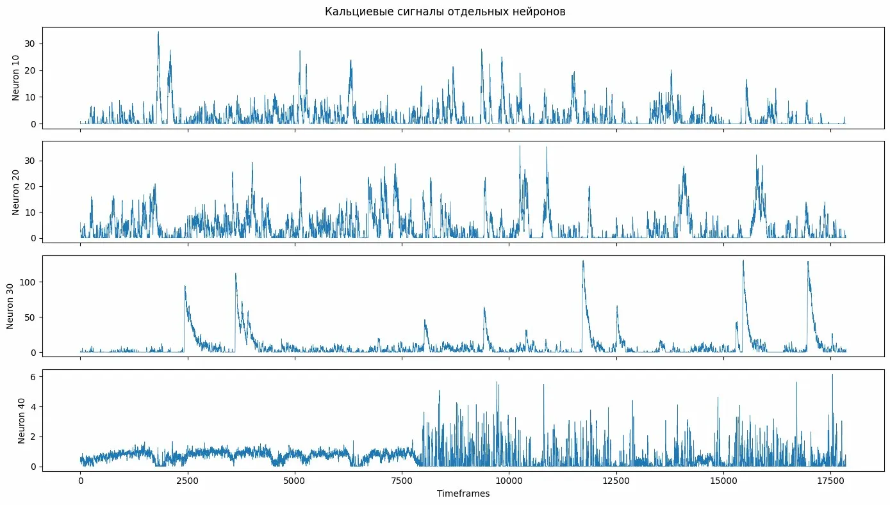

----
## Некоторые формулы которые могу понадобиться

**Reconstruction loss** отрицательный Gaussian log-likelihood:

$$
-\log p(x|r) = \frac{1}{2}\sum_{t,n}\left[\frac{(x_{t,n}-r_{t,n})^2}{\sigma_n^2} + 2\log\sigma_n\right]
$$

где $X_{t,n}$ наблюдение, $r_{t,n}$ предсказанный rate, $\sigma_n$ learned noise для нейрона n (обучаемый параметр log_noise для каждого нейрона)

Суммирование идёт по всем временным шагам (100 или 200) и нейронам (249).

*Gaussian вместо Poisson из оригинальной статьи, потому что кальциевый сигнал непрерывный. По сути это взвешенный MSE, где веса (log_noise) обучаются для каждого нейрона отдельно, отражая разный уровень шума в разных клетках.*

**KL divergence** формула для KL между N(μ, σ²) и N(0,1):

$$
\mathrm{KL} = -\frac{1}{2}\sum_i \left[1 + \log \sigma_i^2 - \mu_i^2 - \sigma_i^2\right]
$$

*KL-дивергенция — штраф, который не даёт энкодеру "запомнить" каждый сегмент отдельно. Она тянет выученное распределение q(g₀|x) к стандартному нормальному N(0,I), делая латентное пространство гладким. Без неё — переобучение, с ней слишком сильной — posterior collapse (модель игнорирует IC).*

---

## Версия 1: базовый LFADS

### Что сделано

Написан LFADS с нуля на PyTorch. Архитектура по статье:
- Двунаправленный GRU-энкодер читает весь сегмент и сжимает его в 64-мерный вектор -- начальное условие g₀
- GRU-генератор из g₀ разворачивает латентную динамику: на каждом кадре выдаёт 20-мерный вектор факторов
- Линейный декодер переводит 20 факторов обратно в 249 нейронов -- предсказывает чистый сигнал

Два отличия от оригинальной статьи: Gaussian модель наблюдений вместо Poisson (кальциевый сигнал непрерывный, не дискретный) и без контроллера (для простоты).

Данные нормализованы min-max на [0,1]. Нарезаны на 177 сегментов по 200 кадров (10 секунд) с перекрытием 50%. Обучение 1000 эпох.

<details> <summary>Показать код</summary>

```py
import torch
import torch.nn as nn
import torch.nn.functional as F
from torch.utils.data import DataLoader, TensorDataset


class SimpleLFADS(nn.Module): #Упрощённая реализация LFADS для кальциевых данных. Без контроллера, с Gaussian моделью наблюдений
    def __init__(self, n_neurons, ic_enc_dim=128, ic_dim=64, gen_dim=128, fac_dim=20, dropout=0.05):
        super().__init__()
        
        self.n_neurons = n_neurons
        self.ic_dim = ic_dim
        self.gen_dim = gen_dim
        self.fac_dim = fac_dim
        
        #ЭНКОДЕР
        # Bi-directional GRU читает весь трайл и выдаёт начальное условие
        self.encoder = nn.GRU(input_size=n_neurons, hidden_size=ic_enc_dim, bidirectional=True, batch_first=True)
        
        # Из выхода энкодера → параметры нормального распределения для g0
        self.ic_mean = nn.Linear(ic_enc_dim * 2, ic_dim)
        self.ic_logvar = nn.Linear(ic_enc_dim * 2, ic_dim)
        
        #ГЕНЕРАТОР
        # Маппинг из IC в начальное состояние генератора
        self.ic_to_gen = nn.Linear(ic_dim, gen_dim)
        
        # Генератор GRU, который разворачивает динамику
        self.generator = nn.GRUCell(
            input_size=fac_dim,  # без контроллера вход = предыдущие факторы
            hidden_size=gen_dim)
        
        # Из состояния генератора в факторы (низкоразмерное представление)
        self.gen_to_fac = nn.Linear(gen_dim, fac_dim)
        
        #ДЕКОДЕР
        # Из факторов в параметры распределения для каждого нейрона
        self.fac_to_rate = nn.Linear(fac_dim, n_neurons)  # mean
        self.log_noise = nn.Parameter(torch.zeros(n_neurons))  # log(std)
        
        self.dropout = nn.Dropout(dropout)
    
    def encode(self, x):
        """x: [batch, time, neurons] → g0_mean, g0_logvar: [batch, ic_dim]"""
        _, h = self.encoder(x)  # h: [2, batch, ic_enc_dim]
        h = torch.cat([h[0], h[1]], dim=-1)  # [batch, ic_enc_dim*2]
        return self.ic_mean(h), self.ic_logvar(h)
    
    def reparameterize(self, mean, logvar):
        std = torch.exp(0.5 * logvar)
        eps = torch.randn_like(std)
        return mean + eps * std
    
    def decode(self, g0, seq_len):
        """
        g0: [batch, ic_dim] в factors: [batch, time, fac_dim], 
                                rates: [batch, time, neurons]
        """
        batch_size = g0.shape[0]
        
        # Начальное состояние генератора
        gen_state = torch.tanh(self.ic_to_gen(g0))  # [batch, gen_dim]
        
        factors_list = []
        rates_list = []
        
        # Начальный вход генератора нули
        fac = torch.zeros(batch_size, self.fac_dim, device=g0.device)
        
        for t in range(seq_len):
            gen_state = self.generator(fac, gen_state)
            fac = self.dropout(self.gen_to_fac(gen_state))
            rate = self.fac_to_rate(fac)
            
            factors_list.append(fac)
            rates_list.append(rate)
        
        factors = torch.stack(factors_list, dim=1)  # [batch, time, fac_dim]
        rates = torch.stack(rates_list, dim=1) # [batch, time, neurons]
        
        return factors, rates
    
    def forward(self, x):
        """
        x: [batch, time, neurons]
        Returns: rates, factors, ic_mean, ic_logvar
        """
        seq_len = x.shape[1]
        
        # Encode
        ic_mean, ic_logvar = self.encode(x)
        
        # Reparameterize
        g0 = self.reparameterize(ic_mean, ic_logvar)
        
        # Decode
        factors, rates = self.decode(g0, seq_len)
        
        return rates, factors, ic_mean, ic_logvar
    
    def loss(self, x, kl_weight=1.0):
        """Вычисление ELBO loss"""
        rates, factors, ic_mean, ic_logvar = self.forward(x)
        
        # Reconstruction loss (Gaussian)
        noise_std = torch.exp(self.log_noise)
        recon_loss = 0.5 * torch.sum(((x - rates) / noise_std) ** 2 + 2 * self.log_noise) / x.shape[0]
        
        # KL divergence
        kl_loss = -0.5 * torch.sum(1 + ic_logvar - ic_mean.pow(2) - ic_logvar.exp()) / x.shape[0]
        
        total_loss = recon_loss + kl_weight * kl_loss
        
        return total_loss, recon_loss, kl_loss, factors
```
</details>

### Результаты

**Кривые обучения.** Loss ушёл в -100000 (отрицательный, это нормально для Gaussian log-likelihood). Но train loss продолжал падать, а valid остановился на -91000. Разрыв ~10%, получилось переобучение. Причина: 141 тренировочный сегмент слишком мало для модели с ~250K параметров.

**Латентные факторы горизонтальные линии.** На графике временной эволюции факторов все 5 кривых практически прямые горизонтальные линии. Генератор нашёл фиксированную точку и выдаёт одну и ту же константу на каждом из 200 кадров. Динамики нет.

**PCA факторов два кластера.** Вместо непрерывного облака, отражающего плавные переходы между состояниями поведения, видны два изолированных кластера. Модель выучила бимодальное представление (вероятно, "движение" и "покой"), но без плавных переходов.

?????????Это признак *posterior collapse* или слишком сильного влияния IC на генератор.???????????????

????????**Isomap распался на 23 компоненты.** Факторы между сегментами не связаны. Нужен overlap-aware метод реконструкции.

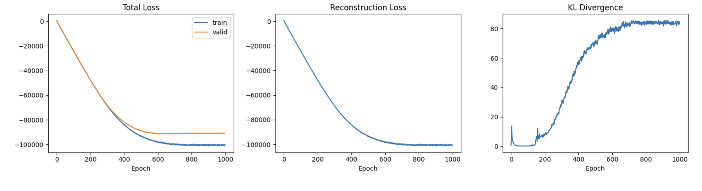
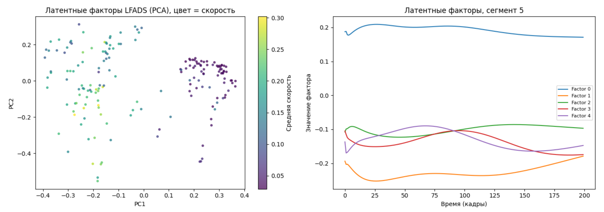
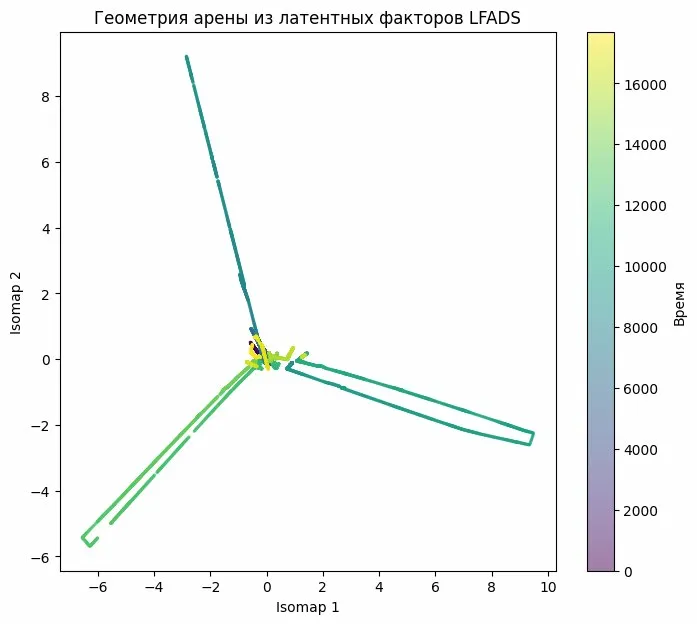

**Декодирование СКОРОСТИ.** $R^2$ предсказания скорости из факторов = 0.28. Из сырых данных = 0.44. Факторы хуже сырых данных.

Из LFADS факторов: $R^2$ train=0.318, valid=0.284

Из сырых данных: $R^2$ train=0.518, valid=0.437

```
def decode_behavior(factors_np, behavior_data, train_idx, valid_idx): #Линейное декодирование поведения из латентных факторов
    # [n_trials, time, dim] -> [n_trials * time, dim]
    n_time = factors_np.shape[1]
    
    X_train = factors_np[train_idx].reshape(-1, factors_np.shape[2])
    X_valid = factors_np[valid_idx].reshape(-1, factors_np.shape[2])
    
    y_train = behavior_data[train_idx].reshape(-1)
    y_valid = behavior_data[valid_idx].reshape(-1)
    
    # Ridge regression
    reg = Ridge(alpha=1.0)
    reg.fit(X_train, y_train)
    
    y_pred_train = reg.predict(X_train)
    y_pred_valid = reg.predict(X_valid)
    
    r2_train = r2_score(y_train, y_pred_train)
    r2_valid = r2_score(y_valid, y_pred_valid)
    
    return r2_train, r2_valid, y_pred_valid, y_valid
```


По сути получился нелинейный PCA, а не динамическая система. В PCA латентного пространства два изолированных кластера вместо непрерывной траектории


---


## Версия 2: исправление нормализации и регуляризации

### Что изменилось

1. **Нормализация:** sqrt-zscore вместо min-max. Sqrt стабилизирует дисперсию кальциевого сигнала (много нулей, редкие большие пики), zscore уравнивает масштабы между нейронами (нейрон 30 срабатывает до 150, нейрон 40 до 6).

2. **Coordinated dropout (CD=0.3):** главный регуляризатор LFADS. На входе энкодера случайно маскируются 30% нейронов (одни и те же на всех кадрах), но на выходе модель должна восстановить ВСЕ 249 нейронов, включая замаскированные. Это заставляет модель учить корреляции между нейронами — популяционную динамику, а не копировать вход на выход.

3. **Больше данных:** сегменты по 100 кадров с перекрытием 80%, получилось 888 сегментов вместо 177. Нормализация loss по всем элементам (не только по batch size).

*не важные изменения*

4. **Усиление KL:** в 1 версии KL-дивергенция составляла 0.075% от total loss, это значит, что оптимизатор её не видел. Нормализация loss по всем элементам (деление на n_time × n_neurons, а не только на batch_size) уравняла масштабы: recon ~0.25, KL ~0.3. Теперь KL реально влияет на структуру латентного пространства.

5. **Правильная сборка непрерывных факторов:** вместо склейки независимых сегментов (что давало 23 disconnected components в Isomap), усреднение факторов в зонах перекрытия. Каждый кадр покрывается ~5 сегментами, их факторы усредняются и получается гладкий непрерывный ряд.

6. **Per-neuron noise model:** для каждого нейрона модель учит свой уровень шума $\sigma_n$. Нейроны с высоким SNR получают маленький $\sigma$ (модель уверена), шумные нейроны большой $\sigma$ (модель "говорит", что не знает какой сигнал -- получается шумный нейрон). Это позволяет модели фокусироваться на информативных нейронах, не тратя ёмкость на шумные.

### Что исправляем (кратко)
1. Z-score нормализация вместо min-max
2. Coordinated dropout (главный регуляризатор в LFADS)
3. Больше сегментов (меньше длина, больше перекрытие)
4. Усиление KL, чтобы факторы были информативными
5. Правильная сборка непрерывных факторов
6. Per-neuron noise model

<details> <summary>Показать код</summary>

```py
class CoordinatedDropout(nn.Module):
    """
    Coordinated Dropout регуляризатор LFADS
    
    Обнуляет одни и те же нейроны на ВХОДЕ энкодера, но оставляет их на ВЫХОДЕ (в reconstruction target). Это заставляет модель реконструировать активность нейронов, которых она не видела т.е. выучивать популяционную динамику, а не identity mapping.
    """
    def __init__(self, rate=0.3):
        super().__init__()
        self.rate = rate
    
    def forward(self, x):
        """x: [batch, time, neurons]. Returns: masked_x, mask"""
        if not self.training or self.rate == 0:
            return x, torch.ones_like(x)
        
        # Маска одинакова для всех timesteps (координированный dropout)
        batch, time, neurons = x.shape
        mask = (torch.rand(batch, 1, neurons, device=x.device) > self.rate).float()
        mask = mask.expand_as(x)
        
        # Масштабирование для сохранения ожидаемого значения
        masked_x = x * mask / (1 - self.rate)
        return masked_x, mask


class LFADS(nn.Module):
    def __init__(self, n_neurons, ic_enc_dim=128, ic_dim=64,
                 gen_dim=200, fac_dim=30, cd_rate=0.3, dropout=0.1):
        super().__init__()
        
        self.n_neurons = n_neurons
        self.ic_dim = ic_dim
        self.gen_dim = gen_dim
        self.fac_dim = fac_dim
        
        # Coordinated dropout
        self.cd = CoordinatedDropout(rate=cd_rate)
        
        #ЭНКОДЕР
        self.encoder = nn.GRU(
            input_size=n_neurons,
            hidden_size=ic_enc_dim,
            bidirectional=True,
            batch_first=True,
            num_layers=1
        )
        self.enc_ln = nn.LayerNorm(ic_enc_dim * 2)
        self.ic_mean = nn.Linear(ic_enc_dim * 2, ic_dim)
        self.ic_logvar = nn.Linear(ic_enc_dim * 2, ic_dim)
        
        # Инициализация logvar чтобы начинать с маленькой дисперсии
        nn.init.constant_(self.ic_logvar.bias, -3.0)
        nn.init.zeros_(self.ic_logvar.weight)
        
        #ГЕНЕРАТОР
        self.ic_to_gen = nn.Linear(ic_dim, gen_dim)
        self.generator = nn.GRUCell(input_size=1, hidden_size=gen_dim)  # минимальный вход
        self.gen_to_fac = nn.Sequential(
            nn.Linear(gen_dim, fac_dim),
            nn.Tanh()  # ограничиваем диапазон факторов
        )
        
        #ДЕКОДЕР
        self.fac_to_rate = nn.Linear(fac_dim, n_neurons)
        # Per-neuron noise (learned)
        self.log_noise = nn.Parameter(torch.zeros(n_neurons))
        
        self.dropout = nn.Dropout(dropout)
    
    def encode(self, x):
        output, h = self.encoder(x)
        h = torch.cat([h[0], h[1]], dim=-1)
        h = self.enc_ln(h)
        return self.ic_mean(h), self.ic_logvar(h)
    
    def reparameterize(self, mean, logvar):
        if self.training:
            std = torch.exp(0.5 * logvar)
            return mean + std * torch.randn_like(std)
        return mean  # при eval не добавляем шум
    
    def decode(self, g0, seq_len):
        batch_size = g0.shape[0]
        gen_state = torch.tanh(self.ic_to_gen(g0))
        
        dummy_input = torch.zeros(batch_size, 1, device=g0.device)
        
        factors_list = []
        rates_list = []
        
        for t in range(seq_len):
            gen_state = self.generator(dummy_input, gen_state)
            fac = self.gen_to_fac(gen_state)
            rate = self.fac_to_rate(self.dropout(fac))
            
            factors_list.append(fac)
            rates_list.append(rate)
        
        factors = torch.stack(factors_list, dim=1)
        rates = torch.stack(rates_list, dim=1)
        return factors, rates
    
    def forward(self, x):
        seq_len = x.shape[1]
        
        # Coordinated dropout на входе энкодера
        x_masked, cd_mask = self.cd(x)
        
        ic_mean, ic_logvar = self.encode(x_masked)
        g0 = self.reparameterize(ic_mean, ic_logvar)
        factors, rates = self.decode(g0, seq_len)
        
        return rates, factors, ic_mean, ic_logvar, cd_mask
    
    def loss(self, x, kl_weight=1.0):
        rates, factors, ic_mean, ic_logvar, cd_mask = self.forward(x)
        
        noise_std = torch.exp(self.log_noise).clamp(min=0.01, max=10.0)
        
        # Reconstruction: Gaussian NLL, нормализованный по размерности
        n_elements = x.shape[0] * x.shape[1] * x.shape[2]
        recon_loss = 0.5 * torch.sum(
            ((x - rates) / noise_std) ** 2 + 2 * torch.log(noise_std)
        ) / n_elements
        
        # KL, нормализованный по batch
        kl_loss = -0.5 * torch.mean(
            1 + ic_logvar - ic_mean.pow(2) - ic_logvar.exp()
        )
        
        total = recon_loss + kl_weight * kl_loss
        return total, recon_loss, kl_loss, factors
    
    @torch.no_grad()
    def extract_factors(self, x): #Извлечение факторов в eval-режиме (без dropout и шума)
        self.eval()
        rates, factors, ic_mean, ic_logvar, _ = self.forward(x)
        return factors.cpu().numpy(), rates.cpu().numpy(), ic_mean.cpu().numpy()
```

</details>

### Результаты

**Переобучение устранено.** Train loss (~0.28) стал *выше* valid (~0.26). То есть получился результат обратный к версии 1 (это хорошо): coordinated dropout делает задачу при обучении сложнее (часть нейронов замаскирована), а при валидации маскировки нет, значит loss ниже.

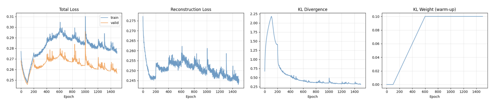

**Латентное пространство стало непрерывным.** Вместо двух кластеров, получилось плавное облако с градиентами (позиция X, Y). Модель выучила пространственную информацию.

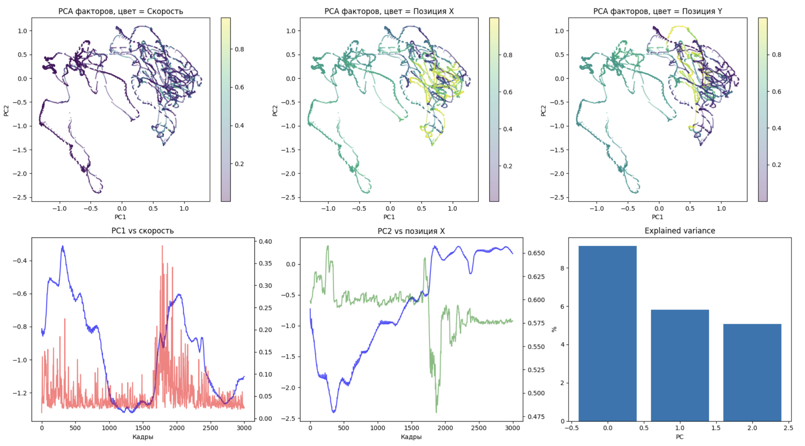
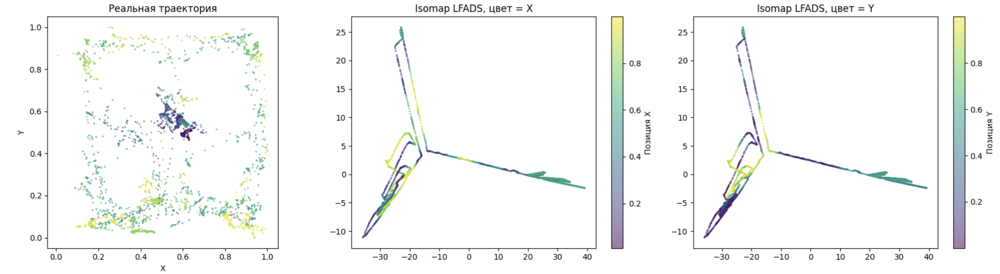

**Декодирование резко улучшилось.** R² скорости: 0.28 в 0.84. R² позиции X: 0.86, Y: 0.88. Факторы теперь несут осмысленную информацию о поведении.

**НО реконструкция по-прежнему горизонтальная.** Красная линия (предсказание LFADS) плоская. Модель предсказывает одну и ту же константу все 100 кадров. Высокий $R^2$ при этом объясняется тем, что декодирование использует средние факторы по сегменту, разные сегменты получают разные константы, и они коррелируют с поведением. Но вся временная информация внутри 5-секундного окна потеряна.

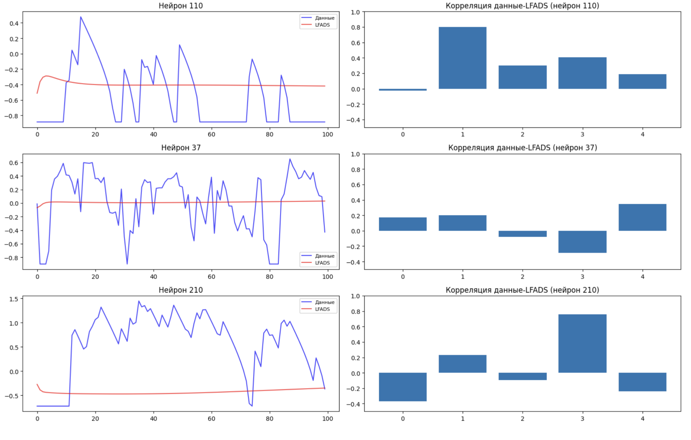

**Корреляция факторов с поведением** показывает осмысленную структуру: разные факторы кодируют разные переменные (Factor 7 → позиция X, Factor 21 → локомоция, Factor 28 → позиция Y).

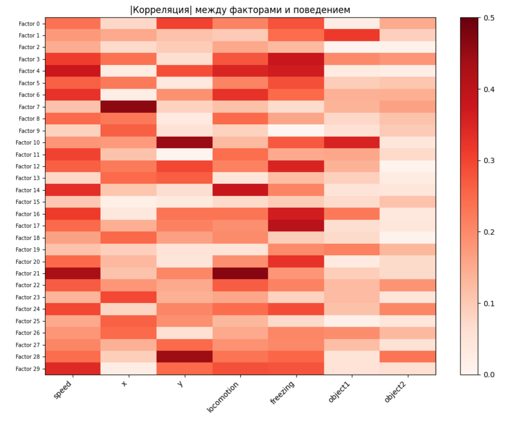

### Вывод

Нормализация и CD решили проблему переобучения и структуры латентного пространства. Но генератор всё ещё выдаёт константу нужен контроллер.


---

## Версия 3: контроллер

### Что изменили

Добавили контроллер вторую RNN, которая на каждом кадре t:
1. Получает информацию от CI-энкодера (bidirectional GRU, который видит весь сегмент)
2. Выдаёт 4-мерный вектор inferred inputs $u_t$
3. Подаёт его в генератор

Без контроллера генератор получает одинаковый вход (нули) на каждом кадре -> не имеет причин менять состояние -> фиксированная точка. С контроллером вход меняется -> состояние меняется -> факторы меняются.

Inferred inputs это вариационные: контроллер выдаёт mean и logvar, из которых сэмплируется $u_t$. KL штрафует отклонение от N(0,1), заставляя контроллер передавать только необходимую информацию.


<details> <summary>Показать код</summary>

```py
class CoordinatedDropout(nn.Module):
    def __init__(self, rate=0.3):
        super().__init__()
        self.rate = rate
    
    def forward(self, x):
        if not self.training or self.rate == 0:
            return x, torch.ones_like(x)
        batch, time, neurons = x.shape
        mask = (torch.rand(batch, 1, neurons, device=x.device) > self.rate).float()
        mask = mask.expand_as(x)
        return x * mask / (1 - self.rate), mask


class LFADS(nn.Module):
    """
    Полная архитектура LFADS с контроллером.
    
    Соответствие статье (Pandarinath et al. 2018, Fig. 1):
    - IC encoder (bi-GRU) → начальное условие g₀
    - CI encoder (bi-GRU) → временные входы для контроллера  
    - Controller (forward GRU) → inferred inputs uₜ
    - Generator (forward GRU) → скрытая динамика → факторы fₜ
    - Readout (linear) → rates для каждого нейрона
    """
    def __init__(self, n_neurons, 
                 ic_enc_dim=128, ci_enc_dim=128,
                 ic_dim=64, co_dim=4,
                 gen_dim=200, con_dim=128, fac_dim=30,
                 cd_rate=0.3, dropout=0.1):
        super().__init__()
        
        self.n_neurons = n_neurons
        self.ic_dim = ic_dim
        self.co_dim = co_dim
        self.gen_dim = gen_dim
        self.con_dim = con_dim
        self.fac_dim = fac_dim
        
        self.cd = CoordinatedDropout(rate=cd_rate)
        
        #IC ЭНКОДЕР: весь трайл → начальное условие
        self.ic_encoder = nn.GRU(
            input_size=n_neurons, hidden_size=ic_enc_dim,
            bidirectional=True, batch_first=True
        )
        self.ic_mean = nn.Linear(ic_enc_dim * 2, ic_dim)
        self.ic_logvar = nn.Linear(ic_enc_dim * 2, ic_dim)
        nn.init.constant_(self.ic_logvar.bias, -3.0)
        nn.init.zeros_(self.ic_logvar.weight)
        
        #CI ЭНКОДЕР: весь трайл → входы контроллера на каждом шаге
        self.ci_encoder = nn.GRU(
            input_size=n_neurons, hidden_size=ci_enc_dim,
            bidirectional=True, batch_first=True
        )
        # CI энкодер выдаёт вектор на каждом шаге t (не только финальный h)
        
        #КОНТРОЛЛЕР: ci_output + факторы → inferred input u_t
        self.controller = nn.GRUCell(
            input_size=ci_enc_dim * 2 + fac_dim,  # CI output + предыдущие факторы
            hidden_size=con_dim
        )
        # Контроллер тоже вариационный: выдаёт mean и logvar для u_t
        self.co_mean = nn.Linear(con_dim, co_dim)
        self.co_logvar = nn.Linear(con_dim, co_dim)
        nn.init.constant_(self.co_logvar.bias, -3.0)
        nn.init.zeros_(self.co_logvar.weight)
        
        #ГЕНЕРАТОР: g₀ + u_t → динамика → факторы
        self.ic_to_gen = nn.Linear(ic_dim, gen_dim)
        self.generator = nn.GRUCell(
            input_size=co_dim,  # вход = inferred inputs от контроллера
            hidden_size=gen_dim
        )
        self.gen_to_fac = nn.Linear(gen_dim, fac_dim)
        
        #ДЕКОДЕР
        self.fac_to_rate = nn.Linear(fac_dim, n_neurons)
        self.log_noise = nn.Parameter(torch.zeros(n_neurons))
        
        self.dropout = nn.Dropout(dropout)
    
    def encode(self, x_masked):
        # IC encoder → финальные hidden states → g₀
        _, h_ic = self.ic_encoder(x_masked)
        h_ic = torch.cat([h_ic[0], h_ic[1]], dim=-1)
        ic_mean = self.ic_mean(h_ic)
        ic_logvar = self.ic_logvar(h_ic)
        
        # CI encoder → output на каждом шаге → входы контроллера
        ci_output, _ = self.ci_encoder(x_masked)  # [batch, time, ci_enc_dim*2]
        
        return ic_mean, ic_logvar, ci_output
    
    def reparameterize(self, mean, logvar):
        if self.training:
            std = torch.exp(0.5 * logvar)
            return mean + std * torch.randn_like(std)
        return mean
    
    def forward(self, x):
        batch, seq_len, n = x.shape
        
        # Coordinated dropout
        x_masked, cd_mask = self.cd(x)
        
        # Encode
        ic_mean, ic_logvar, ci_output = self.encode(x_masked)
        g0 = self.reparameterize(ic_mean, ic_logvar)
        
        # Инициализация
        gen_state = torch.tanh(self.ic_to_gen(g0))  # [batch, gen_dim]
        con_state = torch.zeros(batch, self.con_dim, device=x.device)
        fac = torch.zeros(batch, self.fac_dim, device=x.device)
        
        factors_list = []
        rates_list = []
        co_means = []
        co_logvars = []
        
        for t in range(seq_len):
            # 1. Контроллер: получает CI output + предыдущие факторы
            con_input = torch.cat([ci_output[:, t, :], fac], dim=-1)
            con_state = self.controller(con_input, con_state)
            
            # 2. Inferred input (вариационный)
            u_mean = self.co_mean(con_state)
            u_logvar = self.co_logvar(con_state)
            u = self.reparameterize(u_mean, u_logvar)
            
            co_means.append(u_mean)
            co_logvars.append(u_logvar)
            
            # 3. Генератор: получает inferred input
            gen_state = self.generator(u, gen_state)
            
            # 4. Факторы и rates
            fac = self.gen_to_fac(gen_state)
            rate = self.fac_to_rate(self.dropout(fac))
            
            factors_list.append(fac)
            rates_list.append(rate)
        
        factors = torch.stack(factors_list, dim=1)    # [batch, time, fac_dim]
        rates = torch.stack(rates_list, dim=1)        # [batch, time, neurons]
        co_means = torch.stack(co_means, dim=1)       # [batch, time, co_dim]
        co_logvars = torch.stack(co_logvars, dim=1)   # [batch, time, co_dim]
        
        return rates, factors, ic_mean, ic_logvar, co_means, co_logvars
    
    def loss(self, x, kl_ic_weight=1.0, kl_co_weight=1.0):
        rates, factors, ic_mean, ic_logvar, co_means, co_logvars = self.forward(x)
        
        noise_std = torch.exp(self.log_noise).clamp(min=0.01, max=10.0)
        n_elements = x.shape[0] * x.shape[1] * x.shape[2]
        
        # Reconstruction
        recon_loss = 0.5 * torch.sum(
            ((x - rates) / noise_std) ** 2 + 2 * torch.log(noise_std)
        ) / n_elements
        
        # KL для начальных условий (IC)
        kl_ic = -0.5 * torch.mean(1 + ic_logvar - ic_mean.pow(2) - ic_logvar.exp())
        
        # KL для inferred inputs (CO) суммируется по времени
        kl_co = -0.5 * torch.mean(1 + co_logvars - co_means.pow(2) - co_logvars.exp())
        
        total = recon_loss + kl_ic_weight * kl_ic + kl_co_weight * kl_co
        
        return total, recon_loss, kl_ic, kl_co, factors
    
    @torch.no_grad()
    def extract_factors(self, x):
        self.eval()
        rates, factors, _, _, co_means, _ = self.forward(x)
        return (
            factors.cpu().numpy(), 
            rates.cpu().numpy(),
            co_means.cpu().numpy()  # inferred inputs тоже интересны
        )
```

</details>

### Результаты

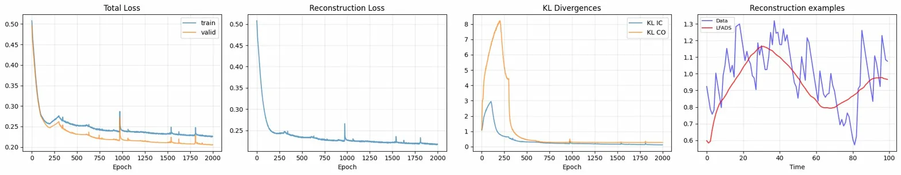

**Факторы стали динамическими.** На графике видно, как 5 факторов поднимаются, опускаются, пересекаются внутри 100-кадрового сегмента. Получилась динамическая система.

**Реконструкция следит за сигналом.** Красная линия теперь повторяет медленную огибающую синих данных. Не идеально (не ловит быстрые пики), но медленные тренды — да.

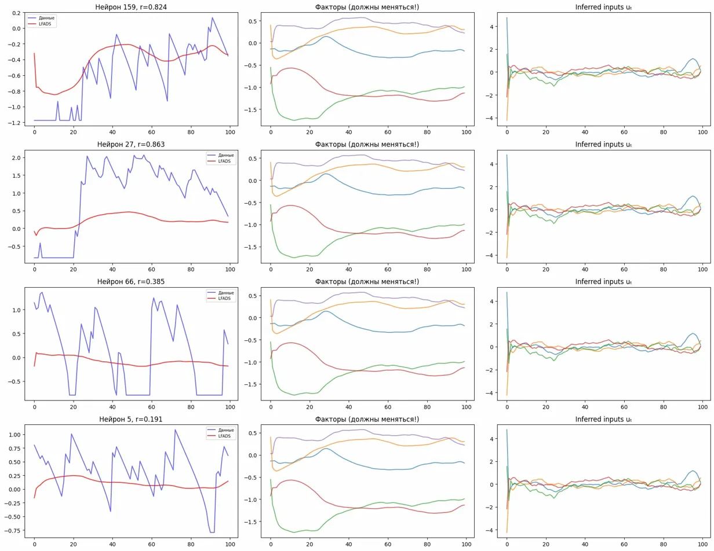

**Per-neuron качество реконструкции.** Медиана корреляции данные-LFADS = 0.63 по всем 249 нейронам. 210 нейронов выше 0.5, ни один ниже 0.1.
```
Нейроны с r > 0.5: 210 / 249
Нейроны с r > 0.7: 78 / 249
Нейроны с r < 0.1: 0 / 249
```

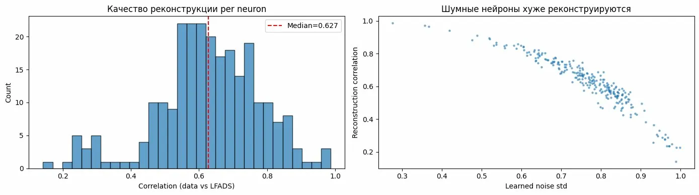

**LFADS > PCA при одинаковой размерности.** Per-timepoint декодирование позиции X: LFADS (30 факторов) = 0.75, PCA (30 компонент) = 0.70. Нелинейная динамическая модель извлекает больше информации, чем линейное снижение размерности.

```
Target                          PCA (30)       LFADS factors (30)        LFADS rates (249)        Raw calcium (249)
-------------------------------------------------------------------------------------------------------------------
speed                             0.335                    0.340                    0.340                    0.473*
x                                 0.704                    0.750                    0.750                    0.850*
y                                 0.690                    0.699                    0.699                    0.858*
locomotion                        0.236                    0.239                    0.239                    0.385*
freezing                          0.369                    0.379                    0.379                    0.465*
```

**Isomap на факторах лучше восстанавливает пространственную структуру арены**, чем Isomap на PCA. Цветовые градиенты (позиция X, Y) более упорядочены.

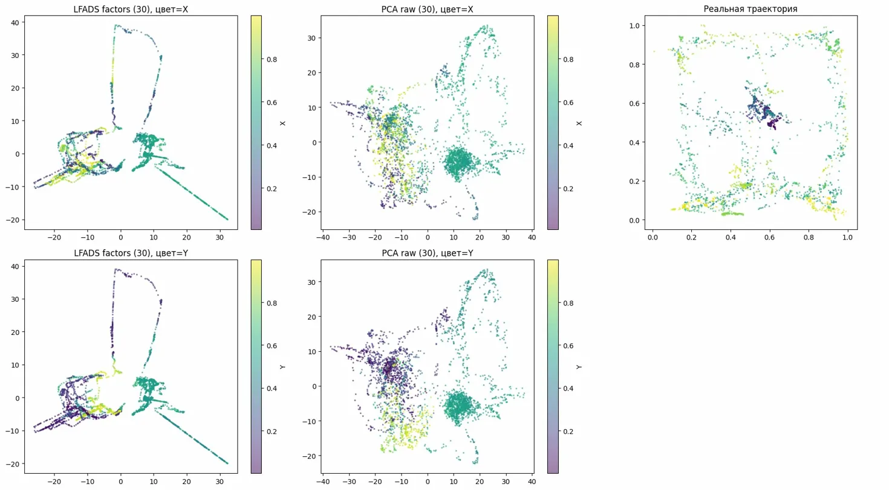
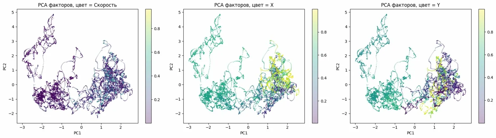

**Непрерывные факторы (после сборки из перекрывающихся сегментов) следят за позицией мыши** на протяжении всех 15 минут записи. PC0 факторов чётко отслеживает Position X.

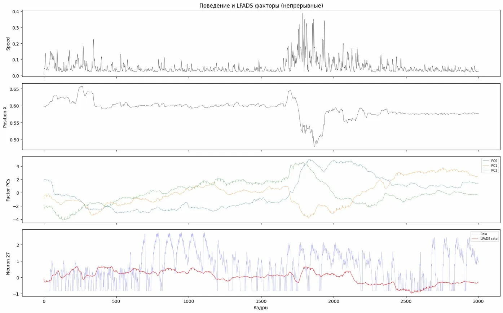

**Inferred inputs бесполезны**. Корреляции с поведением ~0.02-0.08 практически ноль. Контроллер не научился кодировать поведенчески значимые события. Причина: kl_co_max=0.01 слишком сильно давит inferred inputs к нулю. Нужно ослабить.

```
Корреляция inferred inputs с поведением (per-timepoint):
            speed       accel           x           y
u  0       0.029      -0.015      -0.038       0.022
u  1       0.057      -0.012       0.056      -0.080
u  2       0.022      -0.025      -0.026      -0.005
u  3      -0.066       0.007       0.047      -0.035
```

### Вывод

Контроллер нужен. Без него нет динамической системы и LFADS превращается в PCA

Нужно работать над inferred inputs (параметры `kl_co_max` и `co_dim`)


---

## Версия 4: подбор силы контроллера

### Проблема

После v3 стало понятно, что контроллер работает (факторы стали динамическими). Но непонятно, *сколько* информации контроллер должен передавать. Параметр `kl_co_max` определяет "стоимость" одного бита информации через контроллер. Если стоимость **низкая** — контроллер передаёт всё подряд, генератор ленится. Если стоимость **высокая** — контроллер молчит, генератор работает один.

Вопрос: есть ли оптимальное значение?

### Что изменили

1. Увеличили число факторов `fac_dim` с 30 до 50 (чтобы лучше покрыть 249 нейронов)
2. Увеличили размерность выхода контроллера `co_dim` с 4 до 8
3. Обучили 5 моделей с разными значениями `kl_co_max`: `0.0001`, `0.001`, `0.005`, `0.01`, `0.05`

Для каждой модели измерили:
- Качество реконструкции (valid loss: чем ниже, тем точнее модель восстанавливает сигнал)
- Качество декодирования позиции и скорости из факторов ($R^2$: доля объяснённой дисперсии, от 0 до 1)

### Результаты

Декодирование **практически не зависит от kl_co_max**:

| kl_co_max | Valid loss | $R^2$ скорости | $R^2$ позиции X | $R^2$ позиции Y |
|-----------|-----------|-------------|-------------|-------------|
| 0.0001 | 0.079 | 0.362 | 0.821 | 0.777 |
| 0.001 | 0.082 | 0.362 | 0.816 | 0.773 |
| 0.005 | 0.088 | 0.357 | 0.816 | 0.783 |
| 0.01 | 0.090 | 0.353 | 0.821 | 0.787 |
| 0.05 | 0.099 | 0.362 | 0.825 | 0.788 |

Все $R^2$ в пределах 1-2% друг от друга. Valid loss растёт с увеличением kl_co_max (чем дороже контроллер, тем хуже реконструкция), но на декодирование это не влияет.

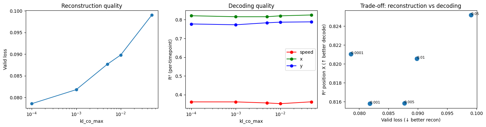

```
Target                          PCA (50)       LFADS factors (50)        LFADS rates (249)                Raw (249)
-------------------------------------------------------------------------------------------------------------------
speed                             0.365                    0.356                    0.356                    0.473*
x                                 0.756                    0.831                    0.831                    0.850*
y                                 0.725                    0.769                    0.769                    0.858*
locomotion                        0.262                    0.258                    0.258                    0.385*
freezing                          0.381                    0.390                    0.390                    0.465*
object1                           0.178                    0.188                    0.188                    0.277*
object2                           0.198                    0.231                    0.231                    0.373*
object3                           0.231                    0.274                    0.274                    0.452*
object4                           0.115                    0.102                    0.102                    0.308*
```

```
Корреляция inferred inputs с поведением (per-timepoint):
            speed       accel           x           y  locomotion
u  0       0.029      -0.010       0.024      -0.044       0.010
u  1       0.078       0.006      -0.015       0.000       0.080
u  2      -0.046       0.005      -0.023      -0.020      -0.045
u  3       0.020      -0.002       0.030       0.025       0.020
u  4      -0.028       0.014      -0.048      -0.013      -0.020
u  5       0.006      -0.014       0.015       0.058       0.015
u  6       0.028       0.010      -0.022       0.018       0.033
u  7      -0.030      -0.007       0.008      -0.003      -0.027
```

**Обнаружена проблема: модель предсказывает почти плоские линии для всех нейронов.**

Красная линия (LFADS) едва меняется внутри сегмента: амплитуда предсказания в 4-5 раз меньше амплитуды данных. Модель ловит только очень медленный тренд, но не кальциевые пики. Высокая корреляция у отдельных нейронов (нейрон 96, r = 0.74) означает лишь то, что направление слабого тренда совпало с данными, а не что модель хорошо реконструирует сигнал. Для других нейронов тот же слабый тренд случайно не совпадает (нейрон 43, r = −0.35) или не связан с данными (нейрон 38, r = 0.04).

Причина: линейный декодер (50 факторов → 249 нейронов) слишком слаб, чтобы восстановить разнообразие 249 нейронов. Факторы кодируют медленную популяционную динамику (позиция мыши, скорость), а быстрые кальциевые пики отдельных нейронов нет.

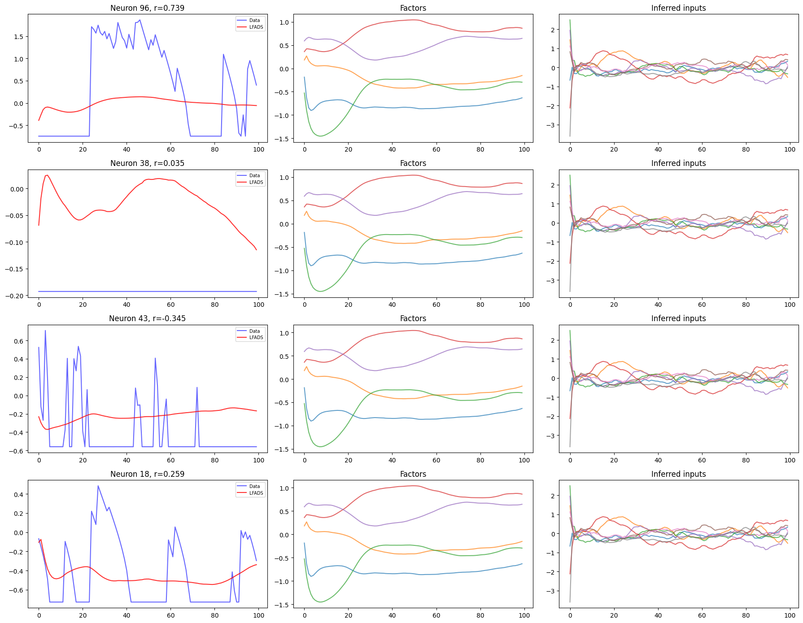

### Вывод

Сила контроллера мало влияет на качество декодирования т. е. основная поведенческая информация уже закодирована в начальных условиях и генераторе. Но нужно решить проблему отрицательных корреляций.


---

## VaLPACa: попытка использовать готовый код

### Что сделали

Попробовали оригинальную реализацию VaLPACa (https://github.com/linclab/valpaca) — иерархическую модель с двумя уровнями: deep model (LFADS для вычислительной динамики) и obs model (кальциевая динамика).

### Попытка 1: staged training (как в оригинале)

Первые 2000 шагов deep model заморожена, учится только obs model. Obs model нашла «лазейку»: вместо того чтобы генерировать спайки и сворачивать их с кальциевым ядром, она просто выдаёт ноль спайков. AR1 кальциевая модель без спайков = экспоненциальный спад от начального значения. Это плохое, но стабильное приближение для данных свободного поведения (средняя активность примерно постоянна). Когда deep model размораживается, она подстраивается под тривиальное решение obs model: rates ≈ 0.

Результат: реконструкция = экспоненциальный спад, спайки = 0, R² ≈ −0.001.

### Попытка 2: без staged training

Обе модели учатся с первого шага. Loss взорвался до 10¹⁵ — positive feedback loop между spike rates и Poisson loss. Потом медленно восстановился за 300 эпох, но внутренние представления уже повреждены.

### Почему VaLPACa работает на Lorenz, но не на наших данных

В оригинальной статье данные синтетические: спайки генерированы из Lorenz аттрактора, потом свёрнуты с кальциевым ядром. Каждый трайл имеет уникальную сложную форму, которую нельзя описать экспоненциальным спадом — obs model вынуждена генерировать реальные спайки. У нас данные свободного поведения, минископ с шумом, 5-секундные окна со слабой структурой — obs model находит дешёвое приближение.

**Графики:** `figures/valpaca_v1_trivial.png`, `figures/valpaca_v2_explosion.png`

---


## Сводная таблица всех версий

| | v1 | v2 | v3 | v4 | v5 | v6 | v7 |
|---|---|---|---|---|---|---|---|
| Контроллер | нет | нет | есть | есть | есть | есть (огранич.) | есть (баланс) |
| Декодер | linear | linear | linear | linear | MLP+baseline | MLP+baseline | MLP+baseline |
| CD rate | нет | 0.3 | 0.3 | 0.3 | 0.3 | 0.3 | 0.3 |
| co_dim | - | - | 4 | 4 | 8 | 2 | 4 |
| kl_co_max | - | - | 0.01 | 0.001-0.05 | 0.001 | 0.1 | 0.01 |
| KL_ic | 75 (ненорм) | 0.3 | 0.3 | 0.3 | 0.0005 | 0.22 | ? |
| KL_co | - | - | 0.23 | 0.1-0.2 | 3.1 | 0.03 | ? |
| Факторы динам.? | нет | нет | да | да | да | частично | да(?) |
| Медиана corr | - | - | 0.63 | 0.63 | 0.79 | 0.75 | ? |
| fac vs PCA | - | - | fac>PCA | fac>PCA | fac<PCA | fac<PCA | fac>PCA(?) |
| rate vs Raw | - | - | rate<Raw | rate<Raw | rate>Raw | rate>Raw | rate>Raw(?) |


---

## CaLFADS: собственная реализация

### Идея

Вместо двух отдельных моделей (как в VaLPACa) — одна модель с кальциевым слоем:

```
Encoder → IC → Generator → Factors → Linear → exp → Spike rates
                                                         ↓
                                                   AR1 Calcium
                                                         ↓
                                              gain × calcium + bias
                                                         ↓
                                            Predicted fluorescence
```

### Ключевые решения (основаны на опыте v1–v7)

1. **Линейный декодер** factors → spike rates (через exp для неотрицательности). Без MLP — чтобы факторы были информативными.

2. **Learnable tau.** Модель сама подбирает постоянную времени кальциевого спада. Инициализация: 5 кадров (~250мс при 20fps).

3. **L1 penalty на спайки** вместо Poisson loss. Простой штраф `mean(spike_rates)` поощряет разреженность, но не взрывается.

4. **Нет staged training.** Всё обучается одновременно.

5. **Coordinated dropout (0.3)**, edge trimming (15 кадров), free bits для IC — все проверенные техники из LFADS экспериментов.

6. **Per-neuron gain и bias** — подстройка под масштаб каждого нейрона.

### Что ожидаем

- Факторы кодируют **вычислительную динамику** (отделённую от кальциевой кинетики)
- Inferred spike rates — автоматическая деконволюция кальциевого сигнала
- Learned tau — оценка реальной постоянной времени GCaMP6s через минископ
- factors > PCA (потому что линейный декодер)
- rates > Raw (потому что де-шумление через динамическую модель)

---
